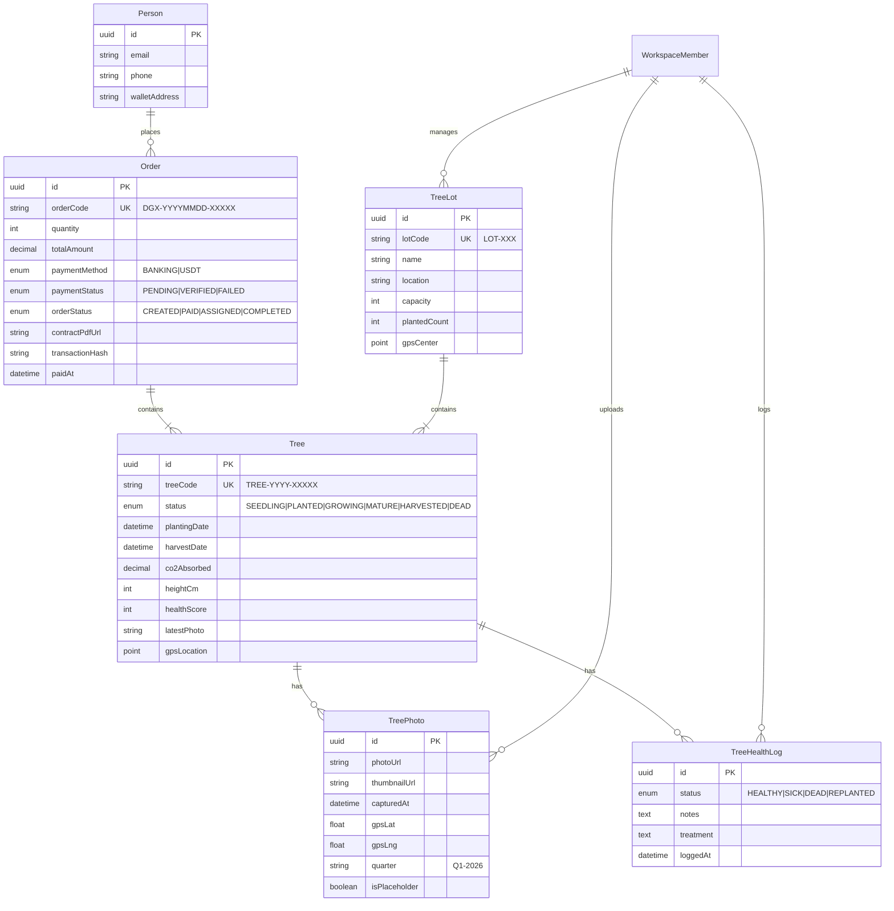
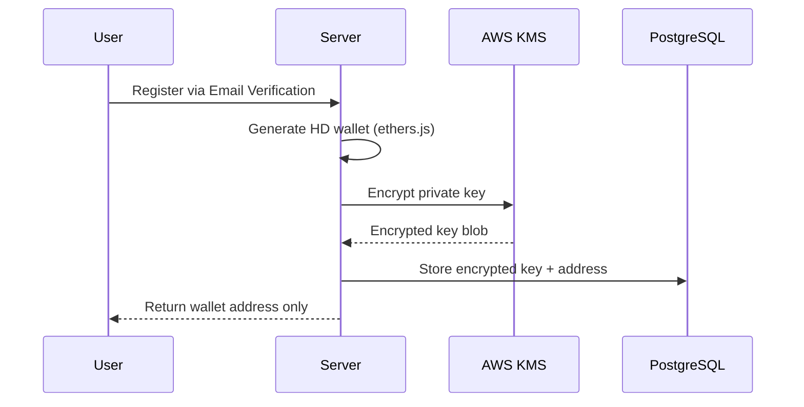

# Architecture Decision Document
## Đại Ngàn Xanh x Twenty CRM Integration

---

## Project Context Analysis

### Requirements Overview

**Functional Requirements (21 FRs across 4 Epics):**

| Epic | Focus | FRs | Priority |
|------|-------|-----|----------|
| Epic 1 | User Acquisition & Onboarding | FR-01 to FR-07 | P0 |
| Epic 2 | Tree Tracking & Dashboard | FR-08 to FR-12 | P0-P2 |
| Epic 3 | Admin Operations | FR-13 to FR-19 | P0-P1 |
| Epic 4 | Viral & Growth | FR-20 to FR-21 | P1-P2 |

**Non-Functional Requirements (7 NFRs):**
- **NFR-01 Performance:** Page load <3s, 1000 concurrent users
- **NFR-02 Security:** HTTPS, PCI DSS, Email verification, RBAC
- **NFR-03 Scalability:** S3 CDN, horizontal DB scaling, 1M users/5 years
- **NFR-04 Reliability:** 99.5% uptime, daily backups
- **NFR-05 Usability:** Mobile-first, WCAG 2.1 AA, multi-language
- **NFR-06 Compliance:** GDPR-like, Vietnam cybersecurity law
- **NFR-07 Observability:** ELK logging, APM, Sentry

**Scale & Complexity:**
- Primary domain: Full-stack web application
- Complexity level: **Medium-High**
- Key challenges: Blockchain wallet integration, real-time payment webhooks, quarterly photo management

### Technical Constraints & Dependencies

1. **Must use Twenty CRM** as base platform (existing investment)
2. **Polygon blockchain** for USDT payments (low gas fees)
3. **S3 + CloudFront** for photo storage (existing Twenty pattern)
4. **SendGrid** for emails (Twenty uses this)
5. **Multi-tenant workspace** architecture from Twenty

### Cross-Cutting Concerns

- **Authentication:** Use Twenty Auth (email verification magic link)
- **File Storage:** Leverage Twenty FileStorage for tree photos
- **Notifications:** Email (Twenty) + Push (new FCM integration)
- **Audit Logging:** Extend Twenty Telemetry for payment/tree events

---

## Architecture Decision: Twenty CRM Integration

### ADR-01: Platform Strategy

**Decision:** Extend Twenty CRM instead of building from scratch

**Context:** Twenty CRM provides 80% of needed infrastructure (auth, RBAC, file storage, email, workflows, GraphQL API, UI components).

**Consequences:**
- ✅ Faster development (reuse existing modules)
- ✅ Consistent admin experience
- ✅ Built-in workspace multi-tenancy
- ⚠️ Must follow Twenty patterns/conventions
- ⚠️ Upgrade path depends on Twenty releases

---

## System Architecture

### High-Level Architecture

```
┌─────────────────────────────────────────────────────────────────────┐
│                           USERS                                      │
├─────────────────────┬───────────────────────────────────────────────┤
│   Landing Page      │           Twenty Frontend                      │
│  (Next.js 16)       │           (React/Vite)                         │
│  dainganxanh.vn     │           twenty.dainganxanh.vn               │
├─────────────────────┴───────────────────────────────────────────────┤
│                      TWENTY BACKEND (NestJS)                         │
├──────────────────────────────────────────────────────────────────────┤
│  ┌─────────────────────────────────────────────────────────────────┐│
│  │                    Core Engine Modules                          ││
│  │  ┌─────────┐  ┌──────────┐  ┌─────────┐  ┌─────────────────┐   ││
│  │  │  Auth   │  │ Workflow │  │  Email  │  │  File Storage   │   ││
│  │  │ (Email) │  │  Engine  │  │(SendGrid│  │  (S3/CDN)       │   ││
│  │  └─────────┘  └──────────┘  └─────────┘  └─────────────────┘   ││
│  └─────────────────────────────────────────────────────────────────┘│
│  ┌─────────────────────────────────────────────────────────────────┐│
│  │                 DAINGANXANH MODULE (NEW)                        ││
│  │  ┌───────────────────┐  ┌──────────────────┐  ┌──────────────┐ ││
│  │  │  Tree Tracking    │  │  Payment Gateway │  │  Share Card  │ ││
│  │  │  - TreeService    │  │  - BankingService│  │  - Generator │ ││
│  │  │  - PhotoService   │  │  - USDTService   │  │  - Controller│ ││
│  │  │  - HealthService  │  │  - WalletService │  └──────────────┘ ││
│  │  │  - CarbonCalc     │  │  - ContractSvc   │                   ││
│  │  └───────────────────┘  └──────────────────┘                   ││
│  └─────────────────────────────────────────────────────────────────┘│
├──────────────────────────────────────────────────────────────────────┤
│  ┌─────────────────────────────────────────────────────────────────┐│
│  │                      DATA LAYER                                 ││
│  │  ┌──────────────┐  ┌──────────────┐  ┌────────────────────────┐││
│  │  │  PostgreSQL  │  │    Redis     │  │  S3 (Tree Photos)      │││
│  │  │  (TwentyORM) │  │   (Cache)    │  │  + CloudFront CDN      │││
│  │  └──────────────┘  └──────────────┘  └────────────────────────┘││
│  └─────────────────────────────────────────────────────────────────┘│
├──────────────────────────────────────────────────────────────────────┤
│                      EXTERNAL SERVICES                               │
│  ┌─────────────┐  ┌─────────────┐  ┌─────────────┐  ┌─────────────┐│
│  │  Banking    │  │  Polygon    │  │  SendGrid   │  │  (Optional) ││
│  │  Webhooks   │  │  (USDT)     │  │  (Email)    │  │  FCM (Push) ││
│  └─────────────┘  └─────────────┘  └─────────────┘  └─────────────┘│
└──────────────────────────────────────────────────────────────────────┘
```

---

## Data Model (Custom Objects in Twenty)

### ADR-02: Data Model Design

**Decision:** Create 5 custom objects extending Twenty's standard object pattern



---

## Module Architecture

### ADR-03: Backend Module Structure

**Decision:** Follow Twenty's module pattern with NestJS

```
packages/twenty-server/src/modules/dainganxanh/
├── dainganxanh.module.ts              # Main module registration
├── tree-tracking/
│   ├── tree-tracking.module.ts
│   └── services/
│       ├── tree.service.ts            # Tree lifecycle/CRUD
│       ├── tree-photo.service.ts      # Photo upload/GPS
│       ├── tree-health.service.ts     # Health status mgmt
│       ├── carbon-calculator.service.ts # CO2 calculations
│       └── quarterly-update.service.ts  # Cron jobs/emails
├── payment/
│   ├── payment.module.ts
│   ├── services/
│   │   ├── banking.service.ts         # Bank transfers/VietQR
│   │   ├── usdt.service.ts            # Polygon payments
│   │   ├── wallet.service.ts          # Wallet generation
│   │   └── contract.service.ts        # PDF generation
│   └── webhooks/
│       ├── banking-webhook.controller.ts
│       └── blockchain-webhook.controller.ts
└── share-card/
    ├── share-card.module.ts
    ├── services/
    │   └── share-card-generator.service.ts  # SVG generation
    └── controllers/
        └── share-card.controller.ts    # Public endpoints
```

### ADR-04: Frontend Architecture

**Decision:** Two-tier frontend approach

| Layer | Tech | Purpose |
|-------|------|---------|
| Landing Page | Next.js 16 (standalone) | SEO, conversion, public pages |
| User Portal | Twenty Frontend (extended) | Dashboard, tree tracking, admin |

**Landing Page Integration:**
- Standalone Next.js app at `packages/dainganxanh-landing/`
- Uses Twenty Auth API for login/signup
- Redirects to Twenty Frontend after purchase

**Twenty Frontend Extensions:**
- New pages: `/my-garden`, `/trees/:id`, `/orders`
- Reuse Twenty Record components for custom objects
- Follow Twenty UI patterns (Emotion, Recoil)

---

## API Design

### ADR-05: API Strategy

**Decision:** Leverage Twenty's GraphQL + add custom REST endpoints

| API Type | Use Case | Endpoint Pattern |
|----------|----------|------------------|
| GraphQL | CRUD for custom objects | `/graphql` |
| REST | Webhooks, public APIs | `/api/dainganxanh/*` |
| REST | Share cards | `/share-card/*` |

**Key REST Endpoints:**

```
# Payment Webhooks
POST /api/dainganxanh/webhooks/banking
POST /api/dainganxanh/webhooks/blockchain

# Share Card (Public)
GET  /share-card/svg?name=...&trees=...&co2=...
GET  /share-card/data?name=...&trees=...
GET  /share-card/page/:orderId

# Public Landing API
POST /api/dainganxanh/orders/create
GET  /api/dainganxanh/stats/counter
```

---

## Security Architecture

### ADR-06: Security Decisions

| Concern | Decision | Implementation |
|---------|----------|----------------|
| Authentication | Use Twenty Auth | Email verification (magic link) |
| Authorization | Twenty RBAC | New roles: TreeOwner, FieldOperator |
| Payment Security | Webhook signature verification | HMAC SHA256 |
| Wallet Security | Server-side HD wallet | Encrypt with KMS |
| File Access | S3 pre-signed URLs | 1-hour expiry |

**Webhook Security:**
```
X-Webhook-Signature: HMAC-SHA256(payload, secret)
IP Whitelist: Banking partner IPs only
Rate Limit: 100 requests/minute
```

---

## Deployment Architecture

### ADR-07: Deployment Strategy

**Decision:** Monorepo deployment with Docker Compose (dev) + Dokploy (prod)

```
┌───────────────────────────────────────────────────┐
│                   DOKPLOY                          │
├───────────────────────────────────────────────────┤
│  ┌─────────────────┐  ┌─────────────────────────┐│
│  │ twenty-server   │  │ twenty-front            ││
│  │ (NestJS)        │  │ (React/Vite)            ││
│  │ Port: 3000      │  │ Port: 3001              ││
│  └─────────────────┘  └─────────────────────────┘│
│  ┌─────────────────┐  ┌─────────────────────────┐│
│  │ landing-page    │  │ worker                  ││
│  │ (Next.js 16)    │  │ (NestJS cron jobs)      ││
│  │ Port: 3002      │  │                         ││
│  └─────────────────┘  └─────────────────────────┘│
├───────────────────────────────────────────────────┤
│  ┌─────────────────┐  ┌─────────────────────────┐│
│  │ PostgreSQL 16   │  │ Redis                   ││
│  └─────────────────┘  └─────────────────────────┘│
└───────────────────────────────────────────────────┘

External: S3, SendGrid, Firebase, Polygon RPC
```

**Environment Variables:**
```env
# Core
DATABASE_URL=postgres://...
REDIS_URL=redis://...

# Dainganxanh specific
DGNX_BANKING_WEBHOOK_SECRET=xxx
DGNX_USDT_WALLET=0x...
DGNX_POLYGON_RPC=https://polygon-rpc.com

# External services
SENDGRID_API_KEY=xxx
AWS_S3_BUCKET=dainganxanh-photos
```

---

## Implementation Phases

### Phase 1: Foundation (Week 1-2)
- [ ] Create 5 custom objects in Twenty
- [ ] Connect backend services to TwentyORM
- [ ] Setup payment webhook endpoints
- [ ] Integrate landing page with Twenty Auth

### Phase 2: Core Features (Week 3-4)
- [ ] User Portal: My Garden, Tree Detail, Order History
- [ ] Admin: Order Management, Photo Upload
- [ ] Email notifications with Twenty Email module

### Phase 3: Growth Features (Week 5-6)
- [ ] Share Card generation
- [ ] Referral system
- [ ] Quarterly update automation
- [ ] Analytics dashboard

---

## Testing Strategy

| Layer | Approach | Tools |
|-------|----------|-------|
| Unit | Service logic | Jest |
| Integration | API endpoints | Supertest |
| E2E | User journeys | Playwright |
| Visual | UI components | Storybook snapshots |

**Key Test Scenarios:**
1. Complete purchase flow (Landing → Payment → Dashboard)
2. Webhook payment verification
3. Tree lifecycle (Seedling → Harvest)
4. Admin photo upload with GPS

---

## Monitoring & Observability

**Decision:** Extend Twenty Telemetry

| Metric Type | Tool | Custom Metrics |
|-------------|------|----------------|
| APM | Sentry | Payment errors, webhook failures |
| Logging | Twenty Logger | Tree events, health updates |
| Analytics | Mixpanel | Conversion funnel, share rate |
| Uptime | UptimeRobot | Webhook endpoints |

**Custom Dashboards:**
- Tree survival rate by lot
- Payment success rate by method
- User engagement (dashboard visits)

---

## Risk Mitigation

| Risk | Mitigation |
|------|------------|
| Payment webhook fails | Retry with exponential backoff, manual verification UI |
| Tree dies | Auto-replant workflow, proactive user notification |
| Blockchain congestion | Lock USDT rate for 15 minutes, show confirmation time |
| Photo storage costs | Aggressive compression, CDN caching |

---

## ADR-08: Caching Strategy

**Decision:** Use Redis for performance-critical data with defined TTL policies

| Cache Key Pattern | Data | TTL | Purpose |
|-------------------|------|-----|---------|
| `tree:counter` | Total trees planted | 30s | Landing page counter |
| `tree:{id}:co2` | CO2 calculation result | 1h | Avoid recalculation |
| `user:{id}:trees` | User's tree list | 5m | Dashboard performance |
| `lot:{id}:stats` | Lot capacity/planted | 10m | Admin dashboard |
| `order:{code}:status` | Order status | 1m | Payment verification |

**Cache Invalidation:**
- Tree counter: Invalidate on new order completion
- CO2 cache: Invalidate on tree status change
- User trees: Invalidate on new tree assignment

**Implementation:**
```typescript
// Use Twenty's existing Redis connection
@Injectable()
class CacheService {
  constructor(private redis: RedisService) {}
  
  async getTreeCounter(): Promise<number> {
    const cached = await this.redis.get('tree:counter');
    if (cached) return parseInt(cached);
    
    const count = await this.treeRepository.count();
    await this.redis.setex('tree:counter', 30, count.toString());
    return count;
  }
}
```

---

## ADR-09: Error Handling Standards

**Decision:** Standardized error response format across all APIs

### Error Response Format
```json
{
  "error": {
    "code": "PAYMENT_VERIFICATION_FAILED",
    "message": "Không thể xác minh thanh toán",
    "details": {
      "orderCode": "DGX-20260109-00001",
      "reason": "Amount mismatch"
    },
    "requestId": "req_abc123",
    "timestamp": "2026-01-09T02:30:00Z"
  }
}
```

### Error Codes
| Code | HTTP Status | Description |
|------|-------------|-------------|
| `ORDER_NOT_FOUND` | 404 | Không tìm thấy đơn hàng |
| `PAYMENT_VERIFICATION_FAILED` | 400 | Xác minh thanh toán thất bại |
| `INVALID_SIGNATURE` | 401 | Chữ ký webhook không hợp lệ |
| `TREE_ALREADY_ASSIGNED` | 409 | Cây đã được gán lô |
| `LOT_CAPACITY_EXCEEDED` | 400 | Lô cây đã đầy |
| `WALLET_GENERATION_FAILED` | 500 | Lỗi tạo ví blockchain |
| `EXTERNAL_SERVICE_ERROR` | 502 | Lỗi dịch vụ bên ngoài |

### Retry Policies
| Service | Max Retries | Backoff | Timeout |
|---------|-------------|---------|---------|
| Banking Webhook | 3 | Exponential (1s, 2s, 4s) | 30s |
| Blockchain RPC | 5 | Linear (2s) | 60s |
| SendGrid Email | 3 | Exponential | 10s |
| S3 Upload | 3 | Exponential | 30s |

---

## ADR-10: Wallet Security Architecture

**Decision:** Server-side HD wallet with AWS KMS encryption

### Wallet Generation Flow


### Security Measures
| Aspect | Implementation |
|--------|----------------|
| Key Derivation | BIP-44 path: `m/44'/60'/0'/0/{index}` |
| Encryption | AES-256-GCM via AWS KMS |
| Key Storage | PostgreSQL (encrypted blob) |
| Access Control | Only payment service can decrypt |
| Audit | Log all key access attempts |

### Key Rotation Policy
- Master key: Rotate annually via KMS
- User keys: No rotation (derived from master)
- Service credentials: Rotate quarterly

### Recovery Procedure
1. User requests recovery via verified email
2. Admin approves recovery request
3. Generate new wallet address
4. Update all pending orders
5. Notify user of new address

> ⚠️ **CRITICAL:** Private keys NEVER leave server. User cannot export keys directly.

---

## Data Migration Strategy

### Twenty Custom Object Creation

**Method:** Use Twenty's GraphQL Metadata API

```graphql
# Step 1: Create Object
mutation CreateTreeObject {
  createOneObject(data: {
    nameSingular: "tree"
    namePlural: "trees"
    labelSingular: "Cây"
    labelPlural: "Cây"
    icon: "IconTree"
    isCustom: true
    isActive: true
  }) {
    id
    nameSingular
  }
}

# Step 2: Create Fields
mutation CreateTreeCodeField {
  createOneField(data: {
    objectMetadataId: "<tree-object-id>"
    name: "treeCode"
    label: "Mã cây"
    type: TEXT
    isCustom: true
    isActive: true
    isNullable: false
  }) {
    id
  }
}
```

### Migration Sequence
1. **Order matters:** Create objects before relations
2. **Dependency order:**
   - TreeLot → Tree (lot relation)
   - Order → Tree (order relation)
   - Tree → TreePhoto, TreeHealthLog

### Seed Data
```sql
-- Initial TreeLot seed
INSERT INTO tree_lot (lot_code, name, location, capacity, gps_center) VALUES
  ('LOT-001', 'Đắk Nông - Lô A', 'Huyện Đắk Mil', 10000, POINT(107.6, 12.4)),
  ('LOT-002', 'Đắk Nông - Lô B', 'Huyện Đắk Song', 8000, POINT(107.5, 12.3)),
  ('LOT-003', 'Lâm Đồng - Lô C', 'Huyện Di Linh', 5000, POINT(108.1, 11.5));
```

### Rollback Plan
1. Export current data via GraphQL
2. Delete custom objects in reverse order
3. Restore from backup if needed
4. Re-run migration scripts

---

## Monitoring Alerts

### Critical Alerts (P0 - Immediate Response)
| Alert | Condition | Action |
|-------|-----------|--------|
| Payment Webhook Down | 0 successful webhooks in 15 min | Page on-call, check banking partner |
| Database Unreachable | Connection timeout > 30s | Auto-failover to replica |
| S3 Upload Failure | Error rate > 5% in 10 min | Check AWS status, notify admin |
| Blockchain RPC Down | 3 consecutive failures | Switch to backup RPC |

### Warning Alerts (P1 - Within 1 hour)
| Alert | Condition | Action |
|-------|-----------|--------|
| High Error Rate | API 5xx > 1% in 5 min | Investigate logs |
| Slow Response | p95 latency > 3s | Check database queries |
| Queue Backlog | Email queue > 1000 | Scale worker instances |
| Low Disk Space | < 20% available | Clean old logs, expand volume |

### Info Alerts (P2 - Daily Review)
| Alert | Condition | Action |
|-------|-----------|--------|
| Daily Order Summary | End of day | Email to admin |
| Tree Health Report | Weekly | Review sick/dead trees |
| Carbon Offset Milestone | Every 1000 trees | Celebrate! 🎉 |

### Alert Channels
- **P0:** PagerDuty → Phone call + Slack
- **P1:** Slack #alerts channel
- **P2:** Email digest

---

## References

- [PRD](file:///Users/mac_1/Documents/GitHub/dainganxanh/docs/prd.md)
- [User Flow](file:///Users/mac_1/Documents/GitHub/dainganxanh/docs/userflow.md)
- [Twenty CRM Docs](https://docs.twenty.com)
- [Implementation Plan](file:///Users/mac_1/.gemini/antigravity/brain/4ff896d7-1251-4048-a43d-785f8a8d58e6/implementation_plan.md)

---

**Document Status:** Complete  
**Next Step:** Begin Epic 1 implementation (Custom Objects)
