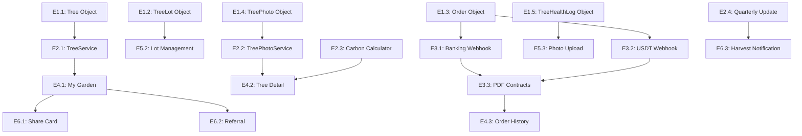

# Epics & Stories: Đại Ngàn Xanh x Twenty CRM

**Project:** Đại Ngàn Xanh  
**Created:** 2026-01-09  
**Based on:** Architecture Document v1.0

---

## Epic Overview

| Epic | Tên | Mô tả | Priority | Duration |
|------|-----|-------|----------|----------|
| E1 | Custom Objects Setup | Tạo 5 custom objects trong Twenty | P0 | 3 ngày |
| E2 | Tree Tracking Integration | Kết nối Tree Tracking Module với database | P0 | 4 ngày |
| E3 | Payment Gateway Integration | Tích hợp Banking + USDT webhooks | P0 | 3 ngày |
| E4 | User Portal | Tạo dashboard cho end-users | P0 | 5 ngày |
| E5 | Admin Dashboard | Quản lý đơn hàng và cây | P0 | 4 ngày |
| E6 | Growth Features | Share cards, referrals, automation | P1 | 5 ngày |

---

## Epic 1: Custom Objects Setup

### E1.1: Tạo Tree Object

**As a** developer,  
**I want** Tree object được tạo trong Twenty với đầy đủ fields,  
**So that** system có thể track từng cây đã bán.

**Acceptance Criteria:**
1. Tree object tồn tại trong Twenty metadata
2. Có các fields: treeCode, status, plantingDate, harvestDate, co2Absorbed, heightCm, healthScore, gpsLocation, latestPhoto
3. Có relations: lot (TreeLot), order (Order), owner (Person)
4. TreeCode format: TREE-YYYY-XXXXX

**Story Points:** 3

---

### E1.2: Tạo TreeLot Object

**As a** developer,  
**I want** TreeLot object được tạo để nhóm các cây theo lô,  
**So that** admin có thể quản lý cây theo vùng địa lý.

**Acceptance Criteria:**
1. TreeLot object tồn tại với fields: lotCode, name, location, capacity, plantedCount, gpsCenter
2. Có relation one-to-many với Tree
3. Có relation với WorkspaceMember (assignedOperator)

**Story Points:** 2

---

### E1.3: Tạo Order Object

**As a** developer,  
**I want** Order object được tạo để track đơn hàng,  
**So that** system có thể quản lý purchases và payments.

**Acceptance Criteria:**
1. Order object tồn tại với fields: orderCode, quantity, totalAmount, paymentMethod, paymentStatus, orderStatus, referralCode, contractPdfUrl, transactionHash
2. Có relations: customer (Person), trees (Tree[]), verifiedBy (WorkspaceMember)
3. OrderCode format: DGX-YYYYMMDD-XXXXX

**Story Points:** 3

---

### E1.4: Tạo TreePhoto Object

**As a** developer,  
**I want** TreePhoto object để lưu ảnh cập nhật cây,  
**So that** users có thể xem tiến độ cây qua thời gian.

**Acceptance Criteria:**
1. TreePhoto object với fields: photoUrl, thumbnailUrl, capturedAt, gpsLat, gpsLng, quarter, isPlaceholder
2. Có relations: tree (Tree), uploadedBy (WorkspaceMember)
3. Quarter format: Q1-2026

**Story Points:** 2

---

### E1.5: Tạo TreeHealthLog Object

**As a** developer,  
**I want** TreeHealthLog object để track lịch sử sức khỏe cây,  
**So that** admin có thể monitor và xử lý khi cây có vấn đề.

**Acceptance Criteria:**
1. TreeHealthLog object với fields: status (HEALTHY/SICK/DEAD/REPLANTED), notes, treatment
2. Có relations: tree (Tree), loggedBy (WorkspaceMember)
3. Status transitions được validate

**Story Points:** 2

---

## Epic 2: Tree Tracking Integration

### E2.1: Kết nối TreeService với TwentyORM

**As a** developer,  
**I want** TreeService được kết nối với Twenty database,  
**So that** có thể CRUD Tree objects qua API.

**Acceptance Criteria:**
1. TreeService inject TwentyORM repository
2. CRUD operations hoạt động: create, findAll, findById, update, delete
3. generateTreeCode tạo unique codes
4. calculateTreeAgeMonths và determineTreeStatus chạy đúng

**Story Points:** 5

---

### E2.2: Kết nối TreePhotoService với S3

**As a** developer,  
**I want** TreePhotoService upload ảnh lên S3,  
**So that** photos được lưu trữ và serve từ CDN.

**Acceptance Criteria:**
1. Upload photo lên S3 với key: trees/{treeCode}/{quarter}/{timestamp}-{filename}
2. Extract GPS từ EXIF metadata
3. Compress images xuống < 2MB
4. Generate thumbnails

**Story Points:** 5

---

### E2.3: Kết nối CarbonCalculatorService

**As a** developer,  
**I want** CarbonCalculatorService tính CO2 cho từng cây,  
**So that** users thấy được impact của họ.

**Acceptance Criteria:**
1. Calculate total CO2 absorbed từ planting date
2. Absorption rates đúng theo age (5kg/year Y1, 10kg Y2-3, 15kg Y4-5, 20kg Y5+)
3. getCO2Equivalents trả về meaningful comparisons

**Story Points:** 3

---

### E2.4: Setup Quarterly Update Cron Job

**As a** developer,  
**I want** cron job gửi quarterly updates tự động,  
**So that** users nhận được báo cáo định kỳ về cây của họ.

**Acceptance Criteria:**
1. Cron job chạy vào tuần cuối của mỗi quý
2. Email template đẹp và responsive
3. Include: số cây, CO2 absorbed, health status, link to dashboard

**Story Points:** 5

---

## Epic 3: Payment Gateway Integration

### E3.1: Tích hợp Banking Webhook

**As a** developer,  
**I want** banking webhook xử lý payment notifications,  
**So that** orders được tự động cập nhật khi thanh toán thành công.

**Acceptance Criteria:**
1. POST /webhooks/banking nhận và verify signature
2. Extract orderCode từ content
3. Validate amount matches order
4. Update order status to PAID
5. Trigger post-payment workflow

**Story Points:** 5

---

### E3.2: Tích hợp USDT Webhook

**As a** developer,  
**I want** blockchain webhook verify USDT payments trên Polygon,  
**So that** crypto payments được xử lý tự động.

**Acceptance Criteria:**
1. POST /webhooks/blockchain nhận notifications từ Alchemy/Moralis
2. Verify transaction on-chain
3. Match payment with pending order
4. Update order status

**Story Points:** 5

---

### E3.3: Generate PDF Contracts

**As a** developer,  
**I want** system tự động tạo PDF hợp đồng sau payment,  
**So that** users nhận được legal documents.

**Acceptance Criteria:**
1. HTML template với đầy đủ thông tin order
2. Convert to PDF và upload S3
3. Send email với attachment
4. Store URL trong order.contractPdfUrl

**Story Points:** 3

---

## Epic 4: User Portal

### E4.1: My Garden Dashboard Page

**As a** tree owner,  
**I want** xem dashboard hiển thị tất cả cây của tôi,  
**So that** tôi có thể theo dõi tiến độ dễ dàng.

**Acceptance Criteria:**
1. Grid view hiển thị tree cards
2. Card shows: photo, status, CO2, planting date
3. Sort by date/status
4. Responsive design (mobile-first)

**Story Points:** 5

---

### E4.2: Tree Detail Page

**As a** tree owner,  
**I want** click vào cây để xem chi tiết,  
**So that** tôi biết vị trí và lịch sử của cây.

**Acceptance Criteria:**
1. Timeline milestones với photos
2. GPS location trên map
3. Health history
4. CO2 metrics với equivalents
5. Download quarterly reports

**Story Points:** 8

---

### E4.3: Order History Page

**As a** tree owner,  
**I want** xem lịch sử đơn hàng,  
**So that** tôi có thể track payments và contracts.

**Acceptance Criteria:**
1. List view với orders
2. Order details: date, quantity, amount, status
3. Download contract PDF
4. View assigned trees

**Story Points:** 3

---

## Epic 5: Admin Dashboard

### E5.1: Order Management View

**As an** admin,  
**I want** quản lý đơn hàng mới,  
**So that** tôi có thể verify và assign trees.

**Acceptance Criteria:**
1. Table view với filters: status, date range
2. Verify payment action
3. Assign to lot action
4. Bulk operations

**Story Points:** 5

---

### E5.2: Tree Lot Management View

**As an** admin,  
**I want** quản lý các lô cây,  
**So that** tôi có thể track capacity và assignments.

**Acceptance Criteria:**
1. Kanban view theo lot
2. Drag & drop trees between lots
3. View lot capacity và location
4. Assign operator

**Story Points:** 5

---

### E5.3: Photo Upload Interface

**As a** field operator,  
**I want** upload ảnh từ mobile,  
**So that** tree owners nhận được updates.

**Acceptance Criteria:**
1. Multi-photo upload
2. Auto-extract GPS from EXIF
3. Tag to lot/trees
4. Compress before upload
5. Preview và confirm

**Story Points:** 5

---

## Epic 6: Growth Features

### E6.1: Share Card Generation

**As a** tree owner,  
**I want** tạo share card đẹp sau khi mua,  
**So that** tôi có thể khoe lên social media.

**Acceptance Criteria:**
1. Auto-generate SVG card với: name, tree count, CO2
2. 1-click share to Facebook
3. Pre-populated share text
4. Include referral link

**Story Points:** 3

---

### E6.2: Referral System

**As a** tree owner,  
**I want** có referral link để invite friends,  
**So that** tôi có thể earn commission.

**Acceptance Criteria:**
1. Generate unique ref code: /ref/{code}
2. Track referrals
3. Display in dashboard với QR code
4. Commission calculation (10% = 26k/tree)

**Story Points:** 5

---

### E6.3: Harvest Notification Automation

**As a** tree owner (5 years),  
**I want** nhận thông báo khi cây sẵn sàng harvest,  
**So that** tôi có thể quyết định next steps.

**Acceptance Criteria:**
1. Cron job check trees approaching 60 months
2. Email notification với 3 options
3. Link to harvest contract page
4. Reminder after 7 days if no response

**Story Points:** 3

---

## Story Status Tracking

| Story | Title | Status | Assigned | Start | End |
|-------|-------|--------|----------|-------|-----|
| E1.1 | Tạo Tree Object | ready-for-dev | - | - | - |
| E1.2 | Tạo TreeLot Object | ready-for-dev | - | - | - |
| E1.3 | Tạo Order Object | ready-for-dev | - | - | - |
| E1.4 | Tạo TreePhoto Object | ready-for-dev | - | - | - |
| E1.5 | Tạo TreeHealthLog Object | ready-for-dev | - | - | - |
| E2.1 | Kết nối TreeService | ready-for-dev | - | - | - |
| E2.2 | Kết nối TreePhotoService | ready-for-dev | - | - | - |
| E2.3 | Kết nối CarbonCalculatorService | ready-for-dev | - | - | - |
| E2.4 | Quarterly Update Cron Job | ready-for-dev | - | - | - |
| E3.1 | Banking Webhook | ready-for-dev | - | - | - |
| E3.2 | USDT Webhook | ready-for-dev | - | - | - |
| E3.3 | PDF Contracts | ready-for-dev | - | - | - |
| E4.1 | My Garden Dashboard | ready-for-dev | - | - | - |
| E4.2 | Tree Detail Page | ready-for-dev | - | - | - |
| E4.3 | Order History Page | ready-for-dev | - | - | - |
| E5.1 | Order Management View | ready-for-dev | - | - | - |
| E5.2 | Tree Lot Management | ready-for-dev | - | - | - |
| E5.3 | Photo Upload Interface | ready-for-dev | - | - | - |
| E6.1 | Share Card Generation | ready-for-dev | - | - | - |
| E6.2 | Referral System | ready-for-dev | - | - | - |
| E6.3 | Harvest Notification | ready-for-dev | - | - | - |

---

**Total Story Points:** ~85  
**Estimated Duration:** 6 weeks (with buffer)

---

## Dependencies

---

**End of Epics & Stories Document**
