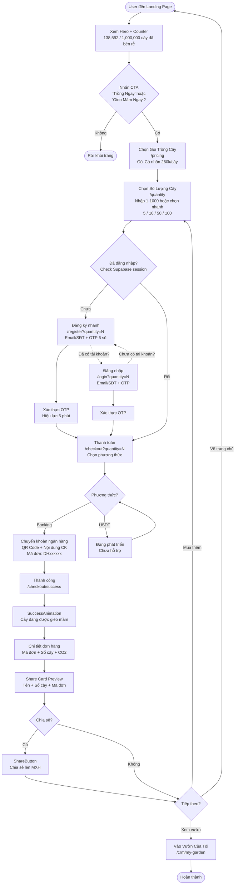
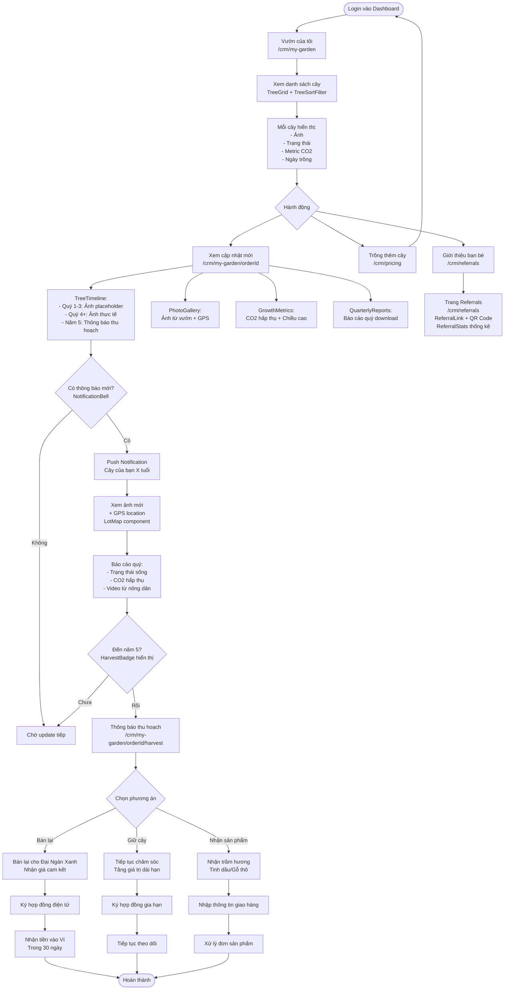
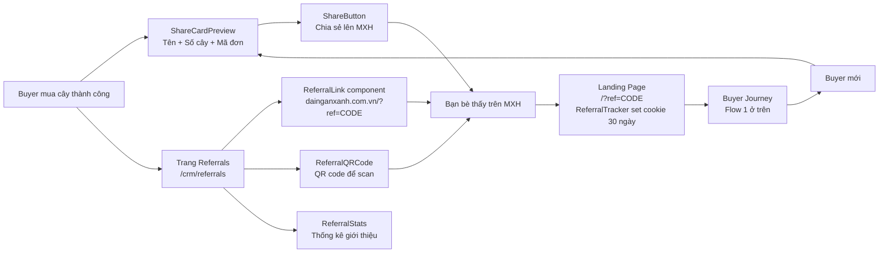
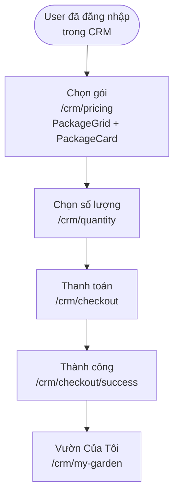
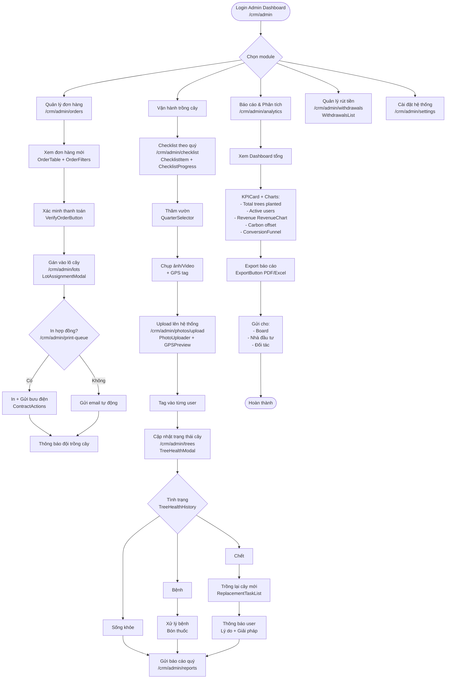

Bộ **User Flow Diagrams** dạng Mermaid cho dự án Đại Ngàn Xanh.
> Cập nhật lần cuối: 2026-03-07 — đồng bộ với code thực tế trong repo.

***

## 1️⃣ FIRST-TIME BUYER JOURNEY

**Routes thực tế:** `/` → `/pricing` → `/quantity` → `/register` | `/login` → `/checkout` → `/checkout/success`

***

## 2️⃣ TREE TRACKING JOURNEY

**Routes thực tế:** `/crm/my-garden` → `/crm/my-garden/[orderId]` → `/crm/my-garden/[orderId]/harvest`

***

## 3️⃣ REFERRAL & VIRAL FLOW

**Routes thực tế:** `/crm/referrals` | `/?ref=CODE`

***

## 4️⃣ CRM - MUA THÊM CÂY (Logged-in User)

**Routes thực tế:** `/crm/pricing` → `/crm/quantity` → `/crm/checkout`

***

## 5️⃣ ADMIN/OPERATIONS FLOW

**Routes thực tế:** `/crm/admin/*`

***

## 📌 Lưu ý khi implement

**Conversion Funnel cần track:**
- Landing → Sign up: Tỷ lệ này nên >15%
- Sign up → Purchase: Nên >60% (vì đã quan tâm)
- Purchase → Share: Nên >30% (viral loop)

**Critical Touch Points:**
- **Instant gratification** sau thanh toán (Share Card + Animation)
- **Quarterly updates** với ảnh thực tế (giữ engagement)
- **Year 5 notification** với 3 options rõ ràng (tránh thất vọng)

**Tech Priority (MVP):**
1. Buyer Flow → Track Flow → Payment Flow (Core)
2. Affiliate Dashboard → Withdrawal (Growth engine)
3. Admin Operations (Cho team vận hành)
4. Corporate Flow (Phase 2, sau khi có case study từ B2C)
