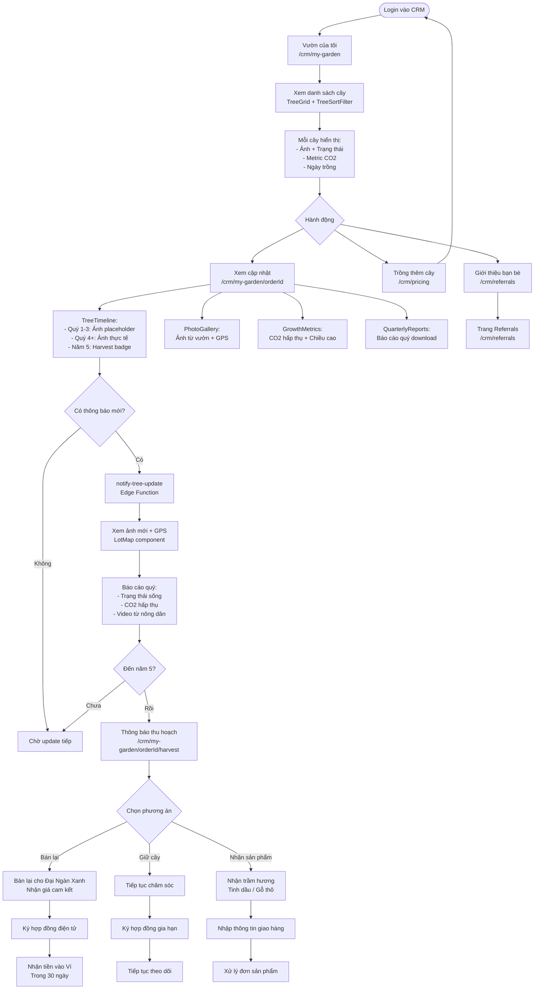
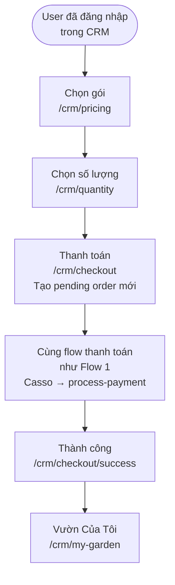
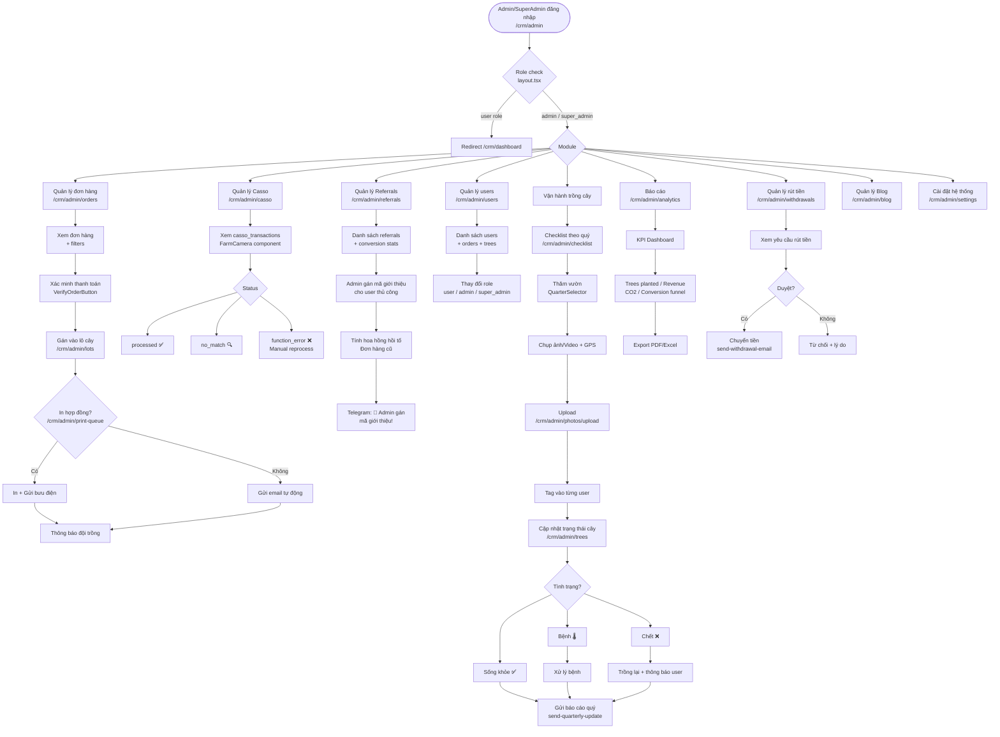

Bộ **User Flow Diagrams** dạng Mermaid cho dự án Đại Ngàn Xanh.
> Cập nhật lần cuối: 2026-03-28 — đồng bộ với code thực tế trong repo.

---

## 1️⃣ FIRST-TIME BUYER JOURNEY

**Routes thực tế:** `/` → `/pricing` → `/quantity` → `/register` | `/login` → `/checkout` → `/checkout/success`

```mermaid
flowchart TD
    Start([User đến Landing Page]) --> View[Xem Hero + Counter<br>138,592 / 1,000,000 cây đã bén rễ]
    View --> Decision{Nhấn CTA<br>'Trồng Ngay'?}
    Decision -->|Không| Exit1([Rời khỏi trang])
    Decision -->|Có| Pricing[Chọn Gói Trồng Cây<br>/pricing<br>Gói Cá nhân 260k/cây]

    Pricing --> Quantity[Chọn Số Lượng Cây<br>/quantity<br>Nhập 1-1000 hoặc chọn nhanh<br>5 / 10 / 50 / 100]

    Quantity --> SessionCheck{Đã đăng nhập?}

    SessionCheck -->|Chưa| Register[Đăng ký nhanh<br>/register?quantity=N<br>Email/SĐT + OTP 6 số]
    SessionCheck -->|Rồi| Checkout

    Register -->|Có ref cookie?| AutoRef[ReferralTracker tự điền<br>mã giới thiệu vào form]
    AutoRef --> VerifyOTP1
    Register -->|Không có ref| VerifyOTP1[Xác thực OTP<br>Hiệu lực 5 phút]
    Register -.->|Đã có tài khoản?| Login[Đăng nhập<br>/login?quantity=N<br>Email/SĐT + OTP]
    Login --> VerifyOTP2[Xác thực OTP]
    Login -.->|Chưa có tài khoản?| Register

    VerifyOTP1 --> Checkout
    VerifyOTP2 --> Checkout

    Checkout[Thanh toán<br>/checkout?quantity=N<br>Tạo pending order DHxxxxxx] --> PayMethod{Phương thức?}
    PayMethod -->|Banking| Banking[Chuyển khoản ngân hàng<br>QR Code + Nội dung CK<br>Mã đơn: DHxxxxxx]
    PayMethod -->|USDT| USDT[Đang phát triển]
    USDT --> PayMethod

    Banking --> CancelOption{Muốn hủy?}
    CancelOption -->|Hủy đơn| CancelOrder[POST /api/orders/cancel<br>Hủy pending order]
    CancelOrder --> Quantity
    CancelOption -->|Chờ thanh toán| WaitPayment[Chờ Casso xác nhận<br>Webhook tự động]

    WaitPayment --> CassoWebhook[Casso gửi Webhook<br>POST /api/webhooks/casso<br>HMAC-SHA512 verified]
    CassoWebhook --> MatchOrder[Match orderCode<br>trong description]
    MatchOrder -->|Khớp| ProcessPay[process-payment<br>Edge Function<br>Tạo trees + contract + email]
    MatchOrder -->|Không khớp| NoMatch[Log: order_not_found<br>Vẫn trả 200 cho Casso]

    ProcessPay --> Trees[Insert trees vào DB<br>Mã cây: TREE-YYYY-xxx]
    Trees --> Contract[generate-contract<br>PDF hợp đồng]
    Contract --> Email[send-email<br>Gửi xác nhận + PDF]
    Email --> TelegramNotify[Telegram Bot<br>Thông báo admin<br>ĐNX - TBAO SALES]

    TelegramNotify --> Success[Thành công<br>/checkout/success]

    Success --> Animation[SuccessAnimation<br>Cây đang được gieo mầm]
    Animation --> OrderSummary[Chi tiết đơn hàng<br>Mã đơn + Số cây + CO2]
    OrderSummary --> ShareCard[Share Card Preview<br>Tên + Số cây + Mã đơn]
    ShareCard --> Share{Chia sẻ?}
    Share -->|Có| Social[ShareButton<br>Chia sẻ lên MXH]
    Share -->|Không| Nav
    Social --> Nav

    Nav{Tiếp theo?}
    Nav -->|Xem vườn| Garden[Vào Vườn Của Tôi<br>/crm/my-garden]
    Nav -->|Về trang chủ| Start
    Nav -->|Mua thêm| Quantity

    Garden --> End([Hoàn thành])
```



---

## 2️⃣ REFERRAL & VIRAL FLOW

**Routes thực tế:** `/crm/referrals` | `/?ref=CODE` | `/register`

```mermaid
flowchart TD
    Buyer[Buyer mua cây thành công] --> ShareCard[ShareCardPreview<br>Tên + Số cây + Mã đơn]
    ShareCard --> ShareBtn[ShareButton<br>Chia sẻ lên MXH]

    Buyer --> RefPage[Trang Referrals<br>/crm/referrals]
    RefPage --> RefLink[ReferralLink<br>dainganxanh.com.vn/?ref=CODE]
    RefPage --> RefQR[ReferralQRCode<br>QR code để scan]
    RefPage --> RefStats[ReferralStats<br>Số lượt / Hoa hồng]

    ShareBtn --> NewVisitor[Bạn bè thấy trên MXH]
    RefLink --> NewVisitor
    RefQR --> NewVisitor

    NewVisitor --> Landing[Landing Page<br>/?ref=CODE]
    Landing --> CookieSet[ReferralTracker Client Component<br>Set cookie 'ref' = CODE<br>30 ngày, first-referrer-wins]
    CookieSet --> TrackClick[trackReferralClick<br>Server Action<br>Ghi referral_clicks vào DB]

    TrackClick --> BuyFlow[Tiếp tục Buyer Journey<br>Flow 1 ở trên]
    BuyFlow --> RegisterPage[/register]
    RegisterPage --> AutoFill[Form tự ẩn ô referral<br>Điền tự động từ cookie]
    AutoFill --> Purchase[Mua thành công]
    Purchase --> Commission[Ghi referral_clicks.converted = true<br>Tính hoa hồng cho referrer]
    Commission --> Notify[Telegram thông báo admin<br>Đơn hàng mới có referral]
```

---

## 3️⃣ TREE TRACKING JOURNEY (User CRM)

**Routes thực tế:** `/crm/my-garden` → `/crm/my-garden/[orderId]` → `/crm/my-garden/[orderId]/harvest`



---

## 4️⃣ CRM - MUA THÊM CÂY (Logged-in User)

**Routes thực tế:** `/crm/pricing` → `/crm/quantity` → `/crm/checkout` → `/crm/checkout/success`



---

## 5️⃣ PAYMENT PROCESSING FLOW (Backend)

**Services:** Casso → Webhook → Edge Function → Supabase → Email + Telegram

```mermaid
flowchart TD
    Transfer[Khách chuyển khoản<br>Nội dung: DHxxxxxx] --> Casso[Casso ghi nhận GD<br>Bank webhook]
    Casso --> WebhookPost[POST /api/webhooks/casso<br>Header: x-casso-signature]

    WebhookPost --> VerifySig{Verify HMAC-SHA512<br>t=timestamp,v1=hash}
    VerifySig -->|Invalid| Reject[Return 401<br>Unauthorized]
    VerifySig -->|Valid| ParseBody[Parse request body]

    ParseBody --> Idempotent{casso_tid đã tồn tại<br>trong DB chưa?}
    Idempotent -->|Có| Return200Dup[Return 200 duplicate<br>Không xử lý lại]
    Idempotent -->|Chưa| LogTx[Insert casso_transactions<br>status: processing]

    LogTx --> CheckType{type == 2<br>hoặc amount <= 0?}
    CheckType -->|Outgoing| SkipTx[Update: no_match<br>Outgoing ignored]

    CheckType -->|Incoming| ParseCode[Regex parse DHxxxxxx<br>từ description]
    ParseCode -->|Không tìm thấy| NoCodeLog[Update: no_match<br>orderCode not found]
    ParseCode -->|Tìm thấy| FindOrder[SELECT orders<br>WHERE code=DHxxxxxx<br>AND status=pending]

    FindOrder -->|Không tìm thấy| NotFoundLog[Update: order_not_found]
    FindOrder -->|Tìm thấy| ValidateAmount{|amount - total_amount|<br><= 1,000đ?}

    ValidateAmount -->|Lệch nhiều| AmountMismatch[Update: amount_mismatch<br>Ghi chênh lệch]
    ValidateAmount -->|Khớp| InvokeFn[Invoke process-payment<br>Edge Function]

    InvokeFn --> GenTrees[Generate tree codes<br>TREE-YYYY-timestamp-idx]
    GenTrees --> UpsertOrder[Update order:<br>pending → completed]
    UpsertOrder --> InsertTrees[Insert trees vào DB]
    InsertTrees --> GenContract[generate-contract<br>Tạo PDF hợp đồng]
    GenContract --> SendEmail[send-email<br>Gửi xác nhận + PDF<br>qua Resend]
    SendEmail --> UpdateLog[Update casso_transactions<br>status: processed]
    UpdateLog --> TelegramMsg[Telegram Bot<br>✅ Thanh toán thành công!<br>→ ĐNX - TBAO SALES group]

    InvokeFn -->|Error| ErrorLog[Update: function_error<br>Ghi lỗi]

    %% All paths return 200 to Casso
    TelegramMsg --> Return200[Return 200 OK<br>Casso không retry]
    NoCodeLog --> Return200
    NotFoundLog --> Return200
    AmountMismatch --> Return200
    SkipTx --> Return200
    ErrorLog --> Return200
```

---

## 6️⃣ ADMIN / OPERATIONS FLOW

**Routes thực tế:** `/crm/admin/*`



---

## 7️⃣ AUTH FLOW

**Routes thực tế:** `/register` → `/login` → `/auth/callback`

```mermaid
flowchart TD
    Start([User chưa đăng nhập]) --> Middleware[Next.js Middleware<br>Kiểm tra /crm/* routes]
    Middleware -->|Chưa auth| RedirectLogin[Redirect /login?redirect=path]
    Middleware -->|Đã auth| AllowAccess[Cho phép truy cập]

    RedirectLogin --> LoginPage[/login<br>Nhập email hoặc SĐT]
    LoginPage --> SendOTP[Supabase gửi OTP<br>Email / SMS]
    SendOTP --> EnterOTP[Nhập mã OTP 6 số<br>Hiệu lực 5 phút]
    EnterOTP --> VerifyOTP{OTP hợp lệ?}
    VerifyOTP -->|Không| RetryOTP[Nhập lại / Gửi lại]
    VerifyOTP -->|Có| AuthCallback[/auth/callback<br>Supabase set session cookie]
    AuthCallback --> CheckRole{Role của user?}
    CheckRole -->|user| UserDashboard[/crm/my-garden]
    CheckRole -->|admin / super_admin| AdminDashboard[/crm/admin]

    AllowAccess --> AccessPage[Trang được yêu cầu]
```

---

---

## 8️⃣ NOTIFICATION MAP (Tất cả điểm gửi thông báo)

```mermaid
flowchart TD
    subgraph TELEGRAM ["📱 Telegram → ĐNX - TBAO SALES (Admin)"]
        T1["🌱 notifyNewOrder\nKhi: Tạo pending order\nFile: /api/orders/pending POST"]
        T2["✅ notifyPaymentSuccess\nKhi: Casso webhook xác nhận thanh toán\nFile: /api/webhooks/casso"]
        T3["🌲 notifyTreeAssigned\nKhi: Admin gán lô cây cho đơn\nFile: actions/assignOrderToLot.ts"]
        T4["💸 notifyWithdrawalRequest\nKhi: User yêu cầu rút tiền\nFile: actions/withdrawals.ts"]
        T5["🤝 notifyReferralAssigned\nKhi: Admin gán mã giới thiệu thủ công\nFile: actions/adminUsers.ts"]
    end

    subgraph EMAIL ["📧 Email → User (qua Resend)"]
        E1["send-email\nKhi: Thanh toán thành công\nTrigger: process-payment edge fn\nNội dung: Xác nhận đơn + mã cây + PDF hợp đồng"]
        E2["send-tree-assignment-email\nKhi: Admin gán lô cây cho đơn\nTrigger: actions/assignOrderToLot.ts\nNội dung: Tên lô + GPS + mã cây"]
        E3["send-withdrawal-email (request_created)\nKhi: User yêu cầu rút tiền\nTrigger: actions/withdrawals.ts\nRecipient: Admin email"]
        E4["send-withdrawal-email (request_approved)\nKhi: Admin duyệt rút tiền\nTrigger: actions/withdrawals.ts\nNội dung: Số tiền + STK + proof"]
        E5["send-withdrawal-email (request_rejected)\nKhi: Admin từ chối rút tiền\nTrigger: actions/withdrawals.ts\nNội dung: Lý do từ chối"]
        E6["send-quarterly-update\nKhi: Admin upload ảnh lô theo quý\nTrigger: notify-tree-update edge fn\nNội dung: Ảnh mới + số liệu tăng trưởng"]
    end

    subgraph EVENTS ["⚡ User/Admin Events"]
        EV1[User tạo pending order]
        EV2[Casso xác nhận thanh toán]
        EV3[Admin gán lô cây]
        EV4[User yêu cầu rút tiền]
        EV5[Admin duyệt rút tiền]
        EV6[Admin từ chối rút tiền]
        EV7[Admin gán mã giới thiệu]
        EV8[Admin upload ảnh quý]
    end

    EV1 --> T1
    EV2 --> T2
    EV2 --> E1
    EV3 --> T3
    EV3 --> E2
    EV4 --> T4
    EV4 --> E3
    EV5 --> E4
    EV6 --> E5
    EV7 --> T5
    EV8 --> E6
```



**Tóm tắt nhanh:**

| Sự kiện | Telegram Admin | Email User | Email Admin |
|---------|---------------|-----------|-------------|
| Tạo pending order | ✅ notifyNewOrder | — | — |
| Thanh toán thành công | ✅ notifyPaymentSuccess | ✅ send-email | — |
| Admin gán lô cây | ✅ notifyTreeAssigned | ✅ send-tree-assignment-email | — |
| User yêu cầu rút tiền | ✅ notifyWithdrawalRequest | — | ✅ send-withdrawal-email |
| Admin duyệt rút tiền | — | ✅ send-withdrawal-email | — |
| Admin từ chối rút tiền | — | ✅ send-withdrawal-email | — |
| Admin gán mã giới thiệu | ✅ notifyReferralAssigned | — | — |
| Upload ảnh quý | — | ✅ send-quarterly-update | — |

---

## 📌 Ghi chú kỹ thuật

**Conversion Funnel cần track:**
- Landing → Sign up: Tỷ lệ nên >15%
- Sign up → Purchase: Nên >60%
- Purchase → Share: Nên >30% (viral loop)

**Critical Touch Points:**
- **Instant gratification** sau thanh toán (Share Card + Animation + Telegram admin alert)
- **Quarterly updates** với ảnh thực tế (giữ engagement)
- **Year 5 notification** với 3 options rõ ràng

**Environment Variables cần thiết:**
- `CASSO_SECURE_TOKEN` — verify Casso webhook HMAC
- `CASSO_API_KEY` — query Casso transaction history
- `TELEGRAM_BOT_TOKEN` + `TELEGRAM_CHAT_ID` — admin notifications
- `RESEND_API_KEY` — email confirmation
- `SUPABASE_SERVICE_ROLE_KEY` — bypass RLS trong API routes + edge functions

**Scheduled Jobs:**
- `cleanup-pending-orders` — hourly via pg_cron, xóa pending orders >24h
- `checklist-reminder` — quarterly, nhắc đội field
- `send-quarterly-update` — quarterly, gửi báo cáo cho users
