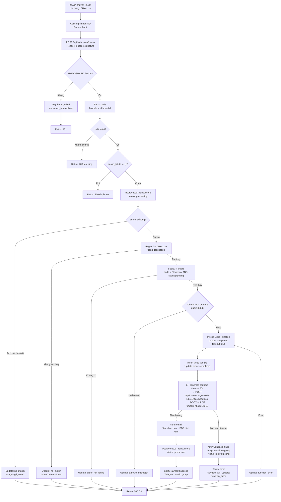
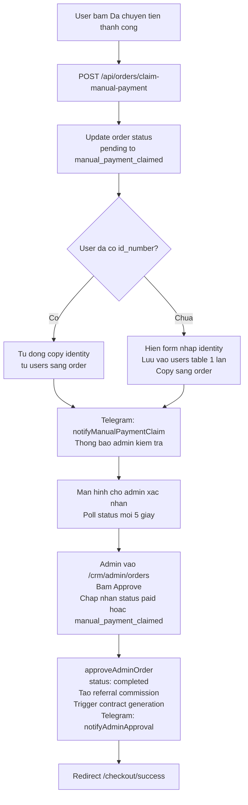
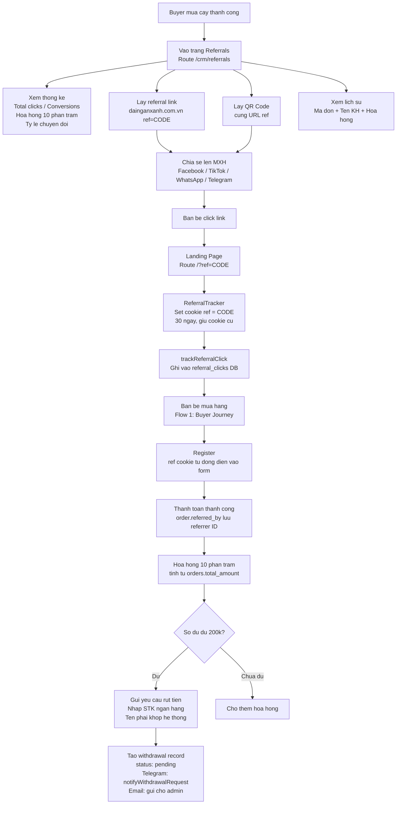
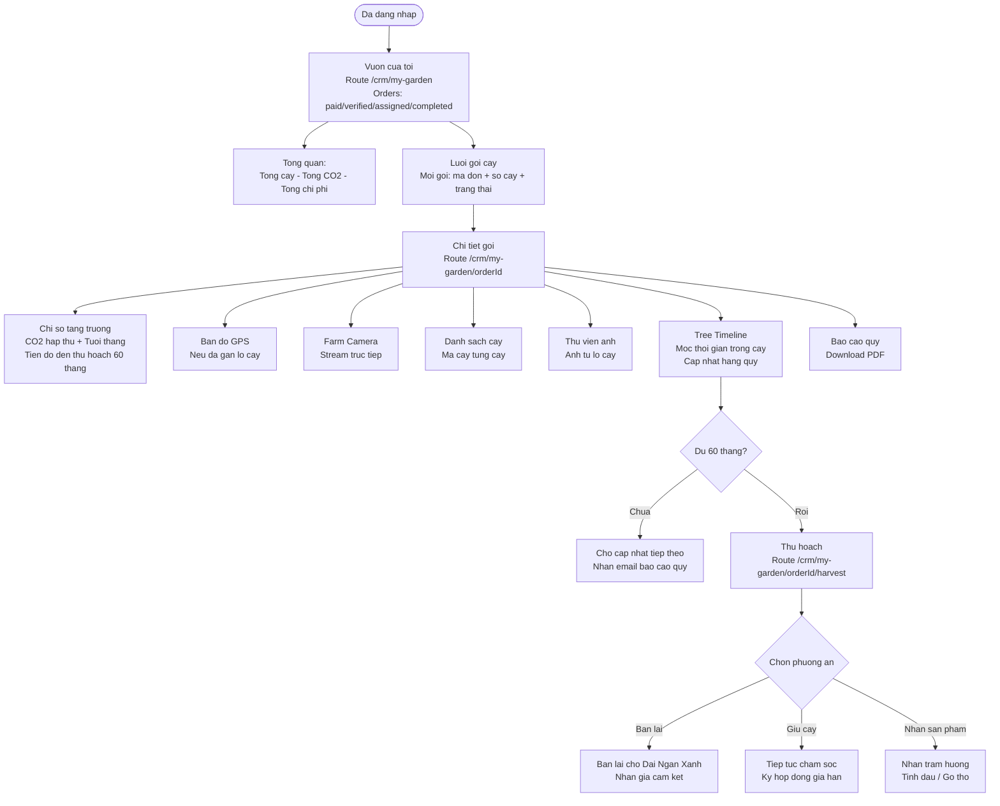
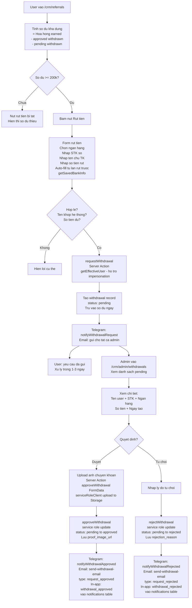
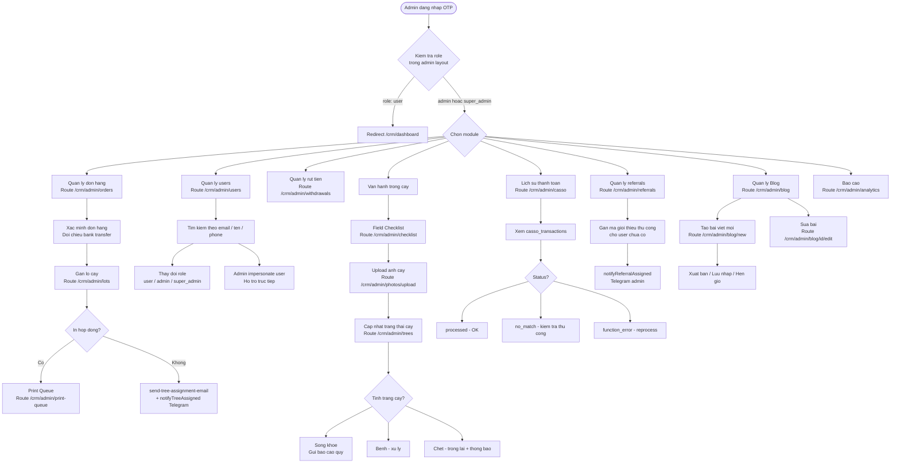
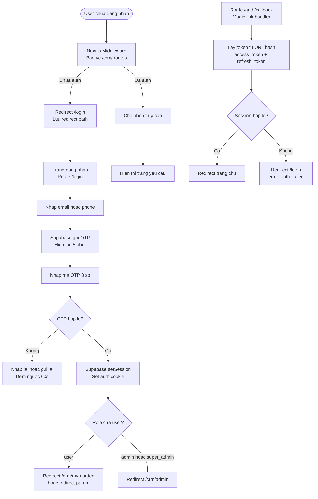
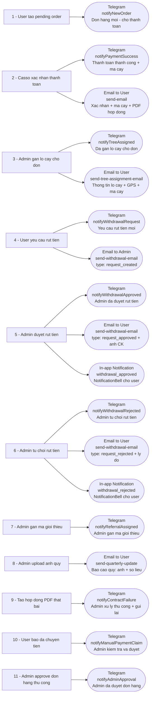

Bộ **User Flow Diagrams** dạng Mermaid cho dự án Đại Ngàn Xanh.

> Cập nhật lần cuối: 2026-04-03 — đồng bộ với code thực tế trong repo (withdrawal notifications, bank auto-fill, impersonation, admin approve paid orders).

## 1️⃣ FIRST-TIME BUYER JOURNEY

**Routes:** `/` → `/pricing` → `/quantity` → `/register` → `/checkout` → `/checkout/success`

```mermaid
flowchart TD
    Start([Vao Landing Page]) --> View[Xem Hero + Features + FAQ]
    View --> CTA{Nhan CTA Trong Ngay?}
    CTA -->|Khong| Exit([Roi khoi trang])
    CTA -->|Co| Pricing[Chon goi trong cay<br>Route /pricing - 260k/cay]

    Pricing --> Quantity[Chon so luong<br>Route /quantity<br>Nhap 1-1000 cay<br>Quick select: 5 / 10 / 50 / 100]

    Quantity --> AuthCheck{Da dang nhap?}
    AuthCheck -->|Roi| Checkout
    AuthCheck -->|Chua| Register[Dang ky nhanh<br>Route /register quantity N<br>Phone hoac Email]

    Register --> OTPStep1[Nhap phone hoac email<br>Co o nhap ma gioi thieu<br>neu chua co ref cookie]
    OTPStep1 --> SendOTP1[Supabase gui OTP<br>Hieu luc 5 phut]
    SendOTP1 --> VerifyOTP1[Nhap ma OTP 8 so]
    VerifyOTP1 --> SetCookie[Set cookie ref<br>Du tru hoac nhap moi<br>Default: DNG895075]
    SetCookie --> Checkout

    Register -.->|Da co tai khoan| Login[Dang nhap<br>Route /login<br>OTP flow tuong tu]
    Login --> Checkout

    Checkout[Thanh toan<br>Route /checkout quantity N] --> LoadCheck{Co pending order?}

    LoadCheck -->|Co| PayStep
    LoadCheck -->|Khong| CompletedCheck{Da co completed order?}
    CompletedCheck -->|Co| RedirectSuccess[Redirect<br>Route /checkout/success]
    CompletedCheck -->|Khong| CreateOrder[Tao pending order tu dong<br>POST /api/orders/pending<br>Format: DH + 6 ky tu<br>Luu referred_by tu ref cookie<br>Telegram: notifyNewOrder]
    CreateOrder --> PayStep

    PayStep[Chuyen khoan<br>Hien thi STK + QR Code<br>Noi dung: ma don DHxxxxxx<br>So tien: quantity x 260000] --> WaitOrCancel{Hanh dong?}
    WaitOrCancel -->|Huy don| CancelOrder[POST /api/orders/cancel<br>Xoa pending order]
    CancelOrder --> Quantity
    WaitOrCancel -->|Cho thanh toan| PollStatus[Poll GET /api/orders/status<br>Kiem tra status don hang]

    PollStatus -->|status = completed| RedirectSuccess
    PollStatus -->|Chua xong| PollStatus

    WaitOrCancel -->|Bam Da chuyen tien| ClaimPayment[POST /api/orders/claim-manual-payment<br>status: manual_payment_claimed<br>Telegram: notifyManualPaymentClaim]

    ClaimPayment --> IdentityCheck{User da co id_number<br>trong bang users?}
    IdentityCheck -->|Chua| IdentityForm[Form thong tin hop dong<br>Ho ten, CCCD, Ngay sinh<br>Dia chi, SĐT, Quoc tich<br>Noi cap, Ngay cap<br>POST /api/orders/identity<br>Luu vao users table 1 lan]
    IdentityCheck -->|Roi| AutoFill[Tu dong dien vao order<br>tu users profile]
    IdentityForm --> WaitAdmin
    AutoFill --> WaitAdmin

    WaitAdmin[Man hinh cho admin xac nhan<br>Route /checkout/waiting<br>Hien thi trang thai don hang<br>Poll status moi 5 giay<br>User co the mua them don khac]

    WaitAdmin -->|Admin approve| RedirectSuccess
    WaitAdmin -->|Mua them| Quantity

    RedirectSuccess --> SuccessPage[Trang thanh cong<br>Route /checkout/success<br>Animation + Ma don + CO2<br>Share Card Preview]

    SuccessPage --> NextStep{Tiep theo?}
    NextStep -->|Xem vuon| Garden[Route /crm/my-garden]
    NextStep -->|Ve trang chu| Start
    NextStep -->|Mua them| Quantity
```

## 2️⃣ PAYMENT PROCESSING (Backend Webhook)

**Services:** Casso Bank → Webhook → Edge Function → Supabase → Email + Telegram

### Manual Payment Claim (User tu bao da chuyen tien)

## 3️⃣ REFERRAL & VIRAL FLOW

**Routes:** `/crm/referrals` → `/?ref=CODE` → `/register`

## 4️⃣ TREE TRACKING JOURNEY (User CRM)

**Routes:** `/crm/my-garden` → `/crm/my-garden/[orderId]` → `/crm/my-garden/[orderId]/harvest`

## 5️⃣ WITHDRAWAL FLOW

**Routes:** `/crm/referrals` → admin `/crm/admin/withdrawals`

## 6️⃣ ADMIN OPERATIONS FLOW

**Routes:** `/crm/admin/*` — yeu cau role admin hoac super_admin

## 7️⃣ AUTH FLOW

**Routes:** `/register` → `/login` → `/auth/callback`

## 8️⃣ NOTIFICATION MAP

**Tóm tắt:**

| Sự kiện | Telegram Admin | Email User | Email Admin | In-app User |
| --- | --- | --- | --- | --- |
| Tạo pending order | ✅ notifyNewOrder | — | — | — |
| Thanh toán thành công | ✅ notifyPaymentSuccess | ✅ send-email | — | — |
| Admin gán lô cây | ✅ notifyTreeAssigned | ✅ send-tree-assignment-email | — | — |
| User yêu cầu rút tiền | ✅ notifyWithdrawalRequest | — | ✅ send-withdrawal-email | — |
| Admin duyệt rút tiền | ✅ notifyWithdrawalApproved | ✅ send-withdrawal-email | — | ✅ withdrawal_approved |
| Admin từ chối rút tiền | ✅ notifyWithdrawalRejected | ✅ send-withdrawal-email | — | ✅ withdrawal_rejected |
| Admin gán mã giới thiệu | ✅ notifyReferralAssigned | — | — | — |
| Upload ảnh quý | — | ✅ send-quarterly-update | — | — |
| Tạo hợp đồng PDF thất bại | ✅ notifyContractFailure | — | — | — |
| User báo đã chuyển tiền | ✅ notifyManualPaymentClaim | — | — | — |
| Admin approve đơn hàng | ✅ notifyAdminApproval | — | — | — |

## 📌 Ghi chú kỹ thuật

**Auth:** OTP only (email hoặc phone), không có password. Session dùng Supabase cookie.

**Payment:** Chuyển khoản ngân hàng thủ công, Casso webhook phát hiện và xử lý tự động. Nếu không auto-detect, user bấm "Đã chuyển tiền" → status `manual_payment_claimed` → admin approve thủ công.

**Admin approve order:** `approveAdminOrder` chấp nhận cả đơn hàng có status `paid` (ngoài `manual_payment_claimed`), cho phép admin duyệt đơn đã thanh toán qua Casso nhưng chưa tự động hoàn tất. Gửi Telegram `notifyAdminApproval` khi duyệt.

**Commission:** 10% của `orders.total_amount` khi order `status = completed`. Trừ cả `pending + approved` withdrawals khỏi balance để tránh over-commit.

**RLS:** Admin actions dùng `createServiceRoleClient()` để bypass RLS. User actions dùng session client.

**Referral default:** Nếu không có ref cookie → dùng `DEFAULT_REF = "DNG895075"`.

**Order code format:** `DH` + 6 ký tự alphanumeric ngẫu nhiên (ví dụ: `DH1U90XP`).

**Withdrawal proof upload:** Server action `approveWithdrawal(formData: FormData)` sử dụng `serviceRoleClient` để upload ảnh chuyển khoản lên Supabase Storage `withdrawals` bucket (public, JPEG/PNG/WebP/GIF, tối đa 5MB) và approve trong cùng một request. Thay thế cách upload client-side cũ qua `createBrowserClient()`.

**Withdrawal bank auto-fill:** `getSavedBankInfo()` tự động điền thông tin ngân hàng (tên ngân hàng, STK, tên chủ TK) từ lần rút tiền trước đó, giảm nhập liệu lặp lại cho user.

**Withdrawal notifications:** Khi admin duyệt/từ chối rút tiền, hệ thống gửi đồng thời 3 kênh: Telegram (`notifyWithdrawalApproved`/`notifyWithdrawalRejected`), Email (`send-withdrawal-email`), và In-app notification (insert vào bảng `notifications` → hiển thị trên `NotificationBell`).

**Withdrawal impersonation:** `requestWithdrawal` sử dụng `getEffectiveUser()` thay vì `supabase.auth.getUser()` để hỗ trợ admin impersonate user khi tạo yêu cầu rút tiền.

**Admin withdrawals page:** FK `withdrawals_user_id_public_users_fkey` → `public.users` (thay thế FK cũ trỏ tới `auth.users`). Page sử dụng `force-dynamic` để tránh Server Component caching.

**Impersonation:** Admin có thể impersonate user để hỗ trợ trực tiếp (xem qua `getImpersonationContext()` và `getEffectiveUser()`).

**Contract Generation:** DOCX template → LibreOffice headless DOCX→PDF (Alpine: `font-noto font-noto-extra`). Timeout chain: LibreOffice 45s SIGKILL < EF generate-contract 50s < EF process-payment 55s. Nếu thất bại → Telegram admin alert + payment fail (admin xử lý thủ công và gửi lại hợp đồng).

**Scheduled Jobs:**

- `cleanup-pending-orders` — hourly, xóa pending orders quá 24h
- `checklist-reminder` — quarterly, nhắc đội field
- `send-quarterly-update` — quarterly, gửi báo cáo cho users
- `profile-backfill` — hourly, tạo profiles cho auth users bị thiếu (pg_cron)

**Environment Variables:**

- `CASSO_SECURE_TOKEN` — verify Casso webhook HMAC-SHA512
- `TELEGRAM_BOT_TOKEN` + `TELEGRAM_CHAT_ID` — admin notifications
- `RESEND_API_KEY` — email production (Mailpit khi `SMTP_HOST=inbucket`)
- `SUPABASE_SERVICE_ROLE_KEY` — bypass RLS
- `CONTRACT_API_SECRET` — bảo vệ contract generation endpoint (`/api/contracts/generate`)