# 01 — First-Time Buyer Journey
> Cập nhật: 2026-04-07

## Routes

`/` → `/pricing` → `/quantity` → `/register` → `/checkout` → `/checkout/success`

## Mô tả

Luồng mua cây lần đầu từ landing page đến trang thành công. Có 2 nhánh tùy trạng thái auth: user mới (qua `/register`) và user đã có tài khoản (qua `/login`). Checkout chỉ redirect `/checkout/success` khi có completed order trong vòng 1 giờ.

## Flowchart (Mermaid)

```mermaid
flowchart TD
    Start([Vào Landing Page]) --> View[Xem Hero + Features + FAQ]
    View --> CTA{Nhấn CTA?}
    CTA -->|Không| Exit([Rời khỏi trang])
    CTA -->|Có| Pricing[Chọn gói trồng cây\nRoute /pricing — 260k/cây]

    Pricing --> Quantity[Chọn số lượng\nRoute /quantity\nNhập 1–1000 cây\nQuick select: 5 / 10 / 50 / 100]

    Quantity --> AuthCheck{Đã đăng nhập?}
    AuthCheck -->|Rồi| Checkout
    AuthCheck -->|Chưa| Register[Đăng ký nhanh\nRoute /register?quantity=N]

    Register --> RefCheck{Đã có ref cookie?}
    RefCheck -->|Chưa| InputRef[Nhập mã giới thiệu\nBắt buộc trước khi gửi OTP\nDefault nếu bỏ trống: dainganxanh]
    RefCheck -->|Rồi| InputContact[Nhập email]
    InputRef --> InputContact

    InputContact --> SendOTP[Supabase gửi OTP\nHiệu lực 5 phút]
    SendOTP --> VerifyOTP[Nhập mã OTP 8 số\nDev bypass: 12345678]
    VerifyOTP --> EnsureProfile[ensureUserProfile\nTạo profile nếu chưa có]
    EnsureProfile --> SetRefCookie[Set cookie ref = CODE\n90 ngày\nGiữ cookie cũ nếu đã có]
    SetRefCookie --> Checkout

    Register -.->|Đã có tài khoản| Login[Đăng nhập\nRoute /login\nOTP flow tương tự]
    Login --> Checkout

    Checkout[Route /checkout?quantity=N] --> LoadCheck{Có pending order?}
    LoadCheck -->|Có| PayStep
    LoadCheck -->|Không| CompletedCheck{Có completed order\ntrong vòng 1 giờ?}
    CompletedCheck -->|Có| RedirectSuccess[Redirect /checkout/success]
    CompletedCheck -->|Không| ConfirmStep[Màn hình xác nhận đơn hàng\nHiển thị: số lượng + giá + tổng tiền\nNút: Đặt đơn ngay]

    ConfirmStep -->|Bấm Đặt đơn ngay| CreateOrder[Tạo pending order\nPOST /api/orders/pending\nFormat: DH + 6 ký tự alphanumeric\nLưu referred_by từ ref cookie\nTelegram: notifyNewOrder]
    CreateOrder --> PayStep

    PayStep[Màn hình chuyển khoản\nHiển thị STK + QR Code\nNội dung: DHxxxxxx\nSố tiền: quantity × 260.000đ] --> WaitOrCancel{Hành động?}

    WaitOrCancel -->|Hủy đơn| CancelOrder[POST /api/orders/cancel\nXóa pending order]
    CancelOrder --> Quantity

    WaitOrCancel -->|Chờ thanh toán| PollStatus[Poll GET /api/orders/status\nKiểm tra mỗi 5 giây]
    PollStatus -->|status = completed| RedirectSuccess
    PollStatus -->|Chưa xong| PollStatus

    WaitOrCancel -->|Bấm Đã chuyển tiền| ClaimPayment[POST /api/orders/claim-manual-payment\nstatus: manual_payment_claimed\nTelegram: notifyManualPaymentClaim]

    ClaimPayment --> IdentityCheck{User đã có\nid_number trong users?}
    IdentityCheck -->|Chưa| IdentityForm[Form thông tin hợp đồng\nHọ tên, CCCD, Ngày sinh\nĐịa chỉ, SĐT, Quốc tịch\nNơi cấp, Ngày cấp\nPOST /api/orders/identity\nLưu vào users table 1 lần]
    IdentityCheck -->|Rồi| AutoFill[Tự động điền vào order\ntừ users profile]
    IdentityForm --> WaitAdmin
    AutoFill --> WaitAdmin

    WaitAdmin[Màn hình chờ admin xác nhận\nHiển thị trạng thái đơn hàng\nPoll status mỗi 5 giây\nUser có thể mua thêm đơn khác]
    WaitAdmin -->|Admin duyệt| RedirectSuccess
    WaitAdmin -->|Mua thêm| Quantity

    RedirectSuccess --> SuccessPage[Trang thành công\nRoute /checkout/success\nAnimation + Mã đơn + CO2\nShare Card Preview]

    SuccessPage --> NextStep{Tiếp theo?}
    NextStep -->|Xem vườn| Garden[Route /crm/my-garden]
    NextStep -->|Về trang chủ| Start
    NextStep -->|Mua thêm| Quantity
```

## Ghi chú kỹ thuật

**Confirm step bắt buộc:** User phải bấm "Đặt đơn ngay" để tạo order — không tự động tạo khi vào `/checkout`.

**Checkout redirect logic:** Khi vào `/checkout`, kiểm tra theo thứ tự:
1. Có pending order → hiển thị PayStep ngay
2. Có completed order trong vòng 1 giờ → redirect `/checkout/success`
3. Không có → hiển thị ConfirmStep

**Order code format:** `DH` + 6 ký tự alphanumeric ngẫu nhiên, ví dụ `DH1U90XP`.

**Referral code khi register:** Ref code là bắt buộc trước khi gửi OTP. Nếu user không nhập → default `dainganxanh`. Cookie ref được set sau khi OTP thành công với expiry 90 ngày; nếu đã có cookie cũ thì giữ nguyên (first referrer wins).

**Identity form:** Chỉ thu thập 1 lần — sau đó tự động điền từ `users` table vào mọi order tiếp theo.

**Dev OTP bypass:** Mã `12345678` bỏ qua xác thực OTP trong môi trường development.

**Cancel order:** Xóa hoàn toàn pending order, quay về `/quantity` để user chọn lại.
