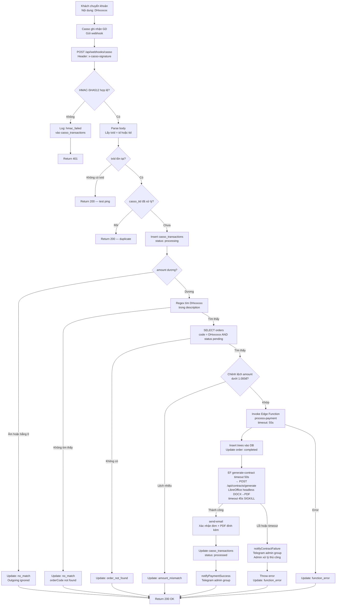
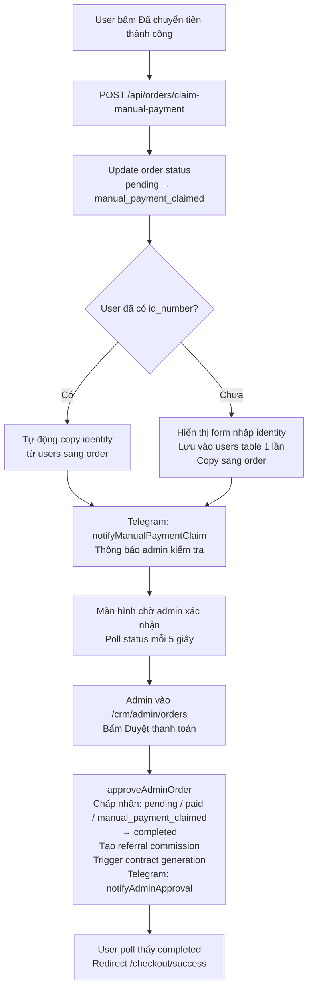

# 02 — Payment Processing
> Cập nhật: 2026-04-07

## Routes

`POST /api/webhooks/casso` → Supabase Edge Functions (`process-payment`, `generate-contract`)

## Mô tả

Có 2 luồng xử lý thanh toán: tự động qua Casso webhook và thủ công khi user tự báo đã chuyển tiền. Admin approve là 1 bước duy nhất, không có bước verify riêng.

## Flowchart (Mermaid)

### Luồng tự động — Casso Webhook

### Luồng thủ công — Manual Payment Claim

## Ghi chú kỹ thuật

**HMAC verify:** Webhook dùng `CASSO_SECURE_TOKEN` để verify chữ ký `x-casso-signature` (HMAC-SHA512). Request không hợp lệ → log vào `casso_transactions` với status `hmac_failed` rồi return 401.

**Deduplication:** Mỗi `casso_tid` chỉ xử lý 1 lần. Nếu đã có trong DB → return 200 ngay, không xử lý lại.

**Timeout chain:** LibreOffice 45s SIGKILL < EF `generate-contract` 50s < EF `process-payment` 55s. Nếu contract generation timeout → Telegram alert admin, payment vẫn fail (admin xử lý và gửi lại hợp đồng thủ công).

**Admin approve — 1 bước duy nhất:** `approveAdminOrder` chấp nhận order có status `pending`, `paid`, hoặc `manual_payment_claimed` và chuyển thẳng sang `completed`. Không còn bước `verifyAdminOrder` riêng.

**Contract resend:** Admin có thể gửi lại hợp đồng từ `/crm/admin/print-queue` qua `resendContract()` trong `printQueue.ts`, tái sử dụng Edge Function `send-email`.

**casso_transactions status values:** `processing`, `processed`, `no_match`, `order_not_found`, `amount_mismatch`, `function_error`, `hmac_failed`.
