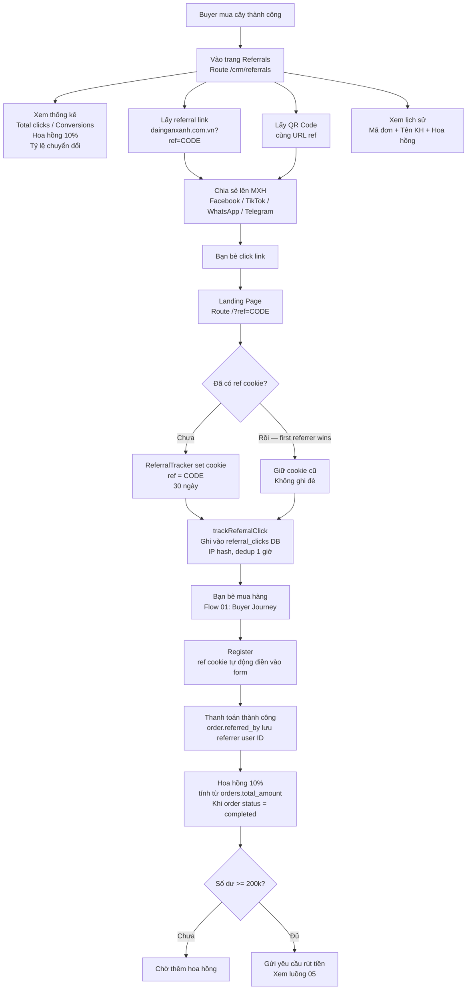

# 03 — Referral & Viral Growth
> Cập nhật: 2026-04-07

## Routes

`/crm/referrals` → `/?ref=CODE` → `/register` → `/checkout`

## Mô tả

User đã mua cây chia sẻ link referral. Khi bạn bè click link, hệ thống set cookie và ghi nhận click. Khi bạn bè hoàn tất mua hàng, người giới thiệu nhận hoa hồng 10% và có thể rút tiền khi đủ 200.000đ.

## Flowchart (Mermaid)

## Ghi chú kỹ thuật

**ReferralTracker cookie:** Set khi user vào `/?ref=CODE`. Expiry 30 ngày. First referrer wins — nếu đã có cookie cũ thì không ghi đè. Cookie này khác với cookie set sau OTP (90 ngày).

**trackReferralClick:** Ghi vào bảng `referral_clicks` với IP hash. Dedup 1 giờ — cùng IP click nhiều lần trong 1 giờ chỉ tính 1 lần.

**referred_by:** Lưu vào `orders.referred_by` khi tạo pending order, lấy từ ref cookie tại thời điểm đó. Default nếu không có cookie: `dainganxanh`.

**Commission tính toán:** 10% của `orders.total_amount`. Chỉ tính khi order `status = completed`. Balance khả dụng = hoa hồng earned - approved withdrawn - pending withdrawn (tránh over-commit).

**Minimum withdrawal:** 200.000đ. Nút rút tiền bị disable nếu số dư chưa đủ.

**Admin assign referral:** Admin có thể gán mã giới thiệu thủ công cho user chưa có qua `/crm/admin/referrals` → `notifyReferralAssigned` Telegram.
