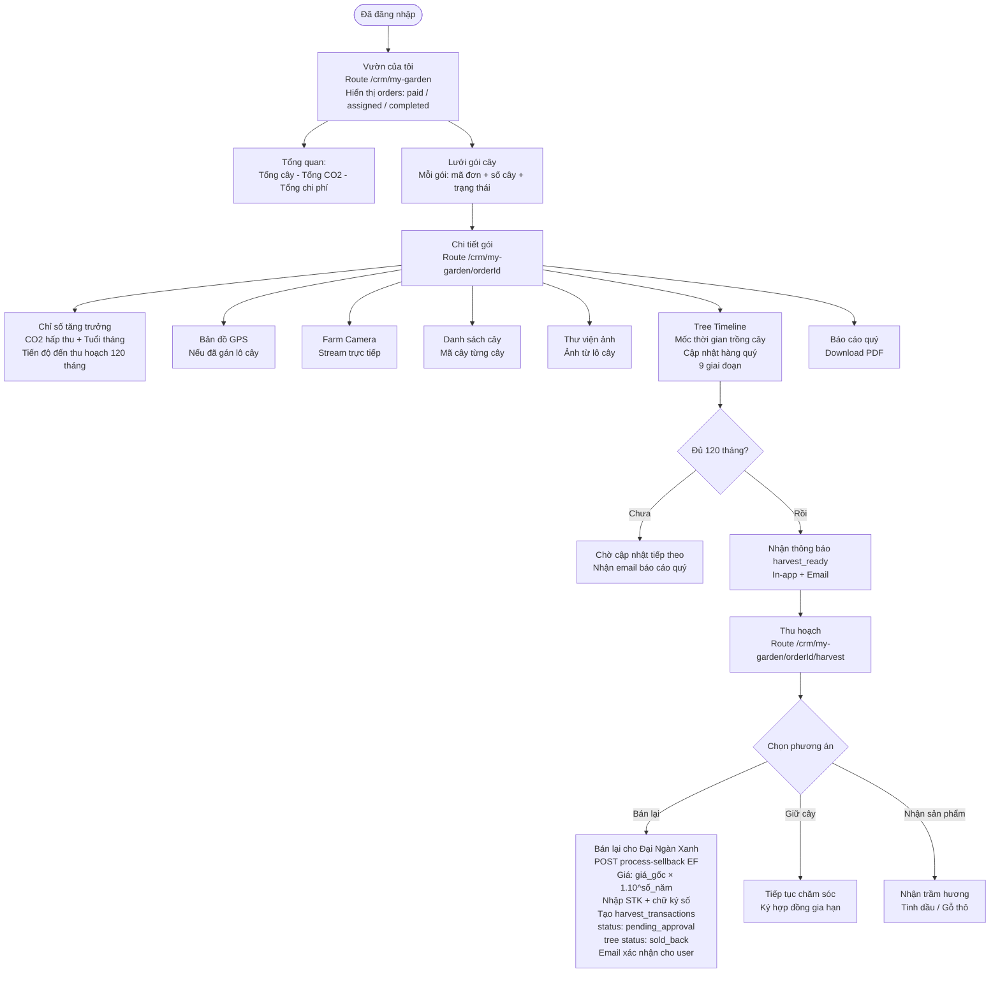
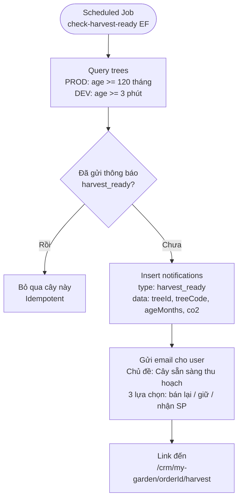

# 04 — Tree Tracking / My Garden (CRM User)
> Cập nhật: 2026-04-07

## Routes

`/crm/my-garden` → `/crm/my-garden/[orderId]` → `/crm/my-garden/[orderId]/harvest`

## Mô tả

User theo dõi vườn cây sau khi mua thành công. Dashboard hiển thị các đơn hàng với status `paid`, `assigned`, `completed`. Chi tiết mỗi đơn gồm metrics tăng trưởng, bản đồ GPS, camera farm, timeline 9 mốc, ảnh và báo cáo. Khi cây đủ 120 tháng, user chọn 1 trong 3 phương án thu hoạch.

## Flowchart (Mermaid)

### Harvest Ready Notification (Scheduled)

## Ghi chú kỹ thuật

**Status hiển thị:** My Garden hiển thị các đơn có status `paid`, `assigned`, `completed`. Không hiển thị `pending` (chưa thanh toán) và không có status `verified`.

**Timeline 9 giai đoạn:** Các mốc tăng trưởng cập nhật hàng quý, hiển thị dạng timeline với popup chi tiết từng giai đoạn.

**Map section:** Chỉ hiển thị khi đơn đã được admin gán lô cây (có GPS coordinates).

**Sell-back pricing:** Giá bán lại = `originalPrice × (1.10)^years` — lãi kép 10%/năm.

**harvest_transactions:** Record tạo với status `pending_approval` khi user chọn bán lại. Admin duyệt và xử lý thanh toán trong 30 ngày làm việc.

**generate-certificate EF:** Edge Function tạo certificate PDF riêng (khác `generate-contract`). Dùng cho harvest certificate — chưa tích hợp vào main flow.

**Quarterly reports:** Admin upload ảnh quý → gửi email báo cáo cho user qua `send-quarterly-update`.
