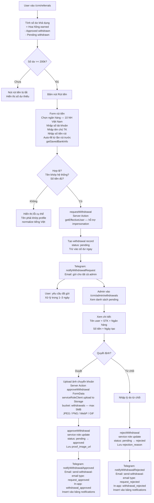

# 05 — Withdrawal Flow
> Cập nhật: 2026-04-07

## Routes

User: `/crm/referrals` — Admin: `/crm/admin/withdrawals`

## Mô tả

User rút hoa hồng khi số dư đủ 200.000đ. Form tự động điền thông tin ngân hàng từ lần rút trước. Admin duyệt hoặc từ chối; cả 2 action đều kích hoạt 3 kênh thông báo đồng thời: Telegram, Email, In-app.

## Flowchart (Mermaid)

## Ghi chú kỹ thuật

**Balance calculation:** Số dư = hoa hồng earned - approved withdrawn - pending withdrawn. Trừ cả pending để tránh user tạo nhiều yêu cầu vượt số dư.

**Bank auto-fill:** `getSavedBankInfo()` lấy thông tin ngân hàng (tên NH, STK, tên chủ TK) từ lần rút tiền trước đó — giảm nhập liệu lặp lại.

**10 ngân hàng Việt Nam hỗ trợ:** Dropdown chọn ngân hàng trong form.

**Name matching:** Tên chủ TK phải khớp với tên trong `users` profile. Hệ thống normalize tiếng Việt trước khi so sánh (bỏ dấu, lowercase).

**Upload proof:** Server action `approveWithdrawal(formData: FormData)` dùng `serviceRoleClient` để upload ảnh chuyển khoản lên Supabase Storage bucket `withdrawals` (public) rồi approve trong cùng một request — thay thế upload client-side cũ.

**Impersonation support:** `requestWithdrawal` dùng `getEffectiveUser()` thay vì `supabase.auth.getUser()` để admin có thể tạo yêu cầu rút tiền thay user khi đang impersonate.

**Withdrawals page:** FK `withdrawals_user_id_public_users_fkey` → `public.users`. Page dùng `force-dynamic` để tránh Server Component caching.

**3 kênh thông báo đồng thời:** Khi admin duyệt hoặc từ chối, hệ thống gửi Telegram + Email + In-app notification cùng lúc.
