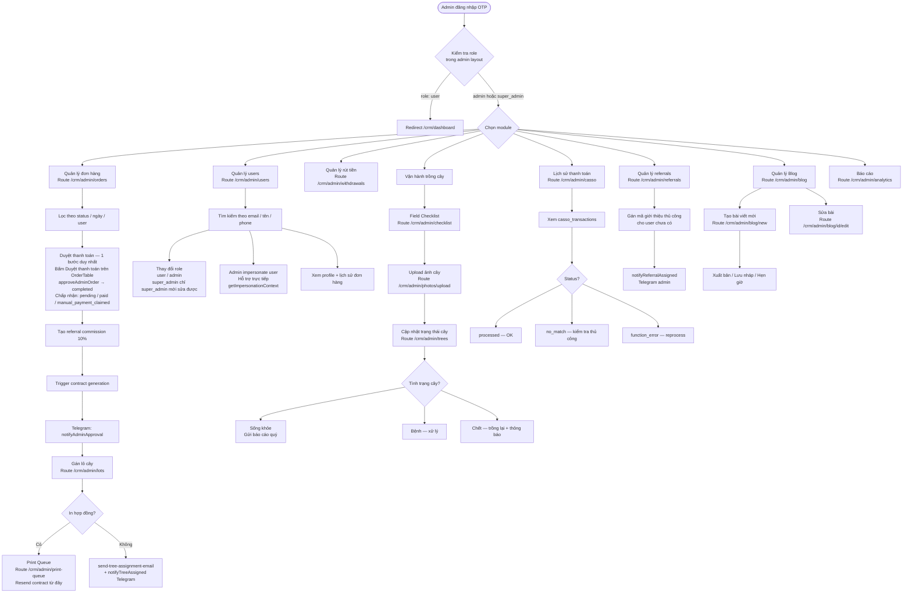

# 06 — Admin Operations
> Cập nhật: 2026-04-07

## Routes

`/crm/admin/*` — yêu cầu role `admin` hoặc `super_admin`

## Mô tả

Admin CRM quản lý toàn bộ vận hành: đơn hàng, users, rút tiền, cây, Casso, referrals, blog. Duyệt đơn là 1 bước duy nhất. Admin có thể impersonate user để hỗ trợ trực tiếp. Super_admin có thể thay đổi role của mọi user (admin không thể thay đổi role super_admin).

## Flowchart (Mermaid)

## Ghi chú kỹ thuật

**Role check:** Admin layout kiểm tra role. User thường bị redirect về `/crm/dashboard`. Route `/crm/admin/*` chỉ accessible với `admin` hoặc `super_admin`.

**Admin approve — 1 bước duy nhất:** Không còn bước verify riêng. `approveAdminOrder` chấp nhận `pending | paid | manual_payment_claimed` → `completed` trong 1 action duy nhất.

**Role protection:** `super_admin` role không thể bị thay đổi bởi `admin`. Chỉ `super_admin` mới có thể sửa role `super_admin` — được bảo vệ bởi RLS policy.

**Impersonation:** Admin impersonate user qua `getImpersonationContext()` và `getEffectiveUser()`. Cho phép admin thực hiện các action thay user (xem vườn, rút tiền hộ). Hỗ trợ trực tiếp không cần password.

**RLS bypass:** Admin actions dùng `createServiceRoleClient()` để bypass RLS. User actions dùng session client.

**Print Queue:** Admin quản lý và resend hợp đồng từ `/crm/admin/print-queue`. `resendContract()` trong `printQueue.ts` tái sử dụng Edge Function `send-email`.

**Scheduled jobs liên quan:**
- `cleanup-pending-orders` — hourly, xóa pending orders quá 24h
- `checklist-reminder` — quarterly, nhắc đội field
- `send-quarterly-update` — quarterly, gửi báo cáo cho users
- `profile-backfill` — hourly, tạo profiles cho auth users bị thiếu (pg_cron)
