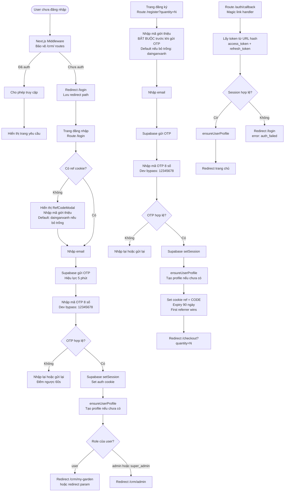

# 07 — Authentication Flow
> Cập nhật: 2026-04-07

## Routes

`/register` → `/login` → `/auth/callback`

## Mô tả

Xác thực chỉ bằng Email OTP (phone đã bị comment out). Register yêu cầu nhập mã giới thiệu trước khi gửi OTP. Login kiểm tra ref cookie và hiển thị modal nhập mã nếu chưa có. Middleware bảo vệ toàn bộ `/crm/*`.

## Flowchart (Mermaid)

## Ghi chú kỹ thuật

**Email OTP only:** Phone OTP đã được comment out trong code. Chỉ hỗ trợ xác thực qua email.

**Register — ref code bắt buộc:** User phải nhập (hoặc confirm) mã giới thiệu trước khi form gửi OTP. Nếu bỏ trống → default `dainganxanh`. Logic này ngăn chặn register không có referral.

**Login — RefCodeModal:** Nếu user đăng nhập mà chưa có ref cookie, hiển thị modal để nhập mã giới thiệu trước. Đảm bảo mọi session đều có referral context.

**ensureUserProfile:** Được gọi sau mỗi OTP success (cả register, login, auth/callback). Tạo bản ghi trong `public.users` nếu chưa tồn tại — đảm bảo profile luôn có trước khi user vào CRM.

**Cookie expiry:**
- `ReferralTracker` (ref cookie từ landing page): 30 ngày
- Cookie ref set sau OTP (register/login): 90 ngày
- First referrer wins — không ghi đè cookie đã có

**Dev bypass:** OTP `12345678` bỏ qua xác thực trong môi trường development. Không hoạt động trên production.

**Middleware:** Bảo vệ toàn bộ `/crm/*`. Lưu `redirect` param để sau khi login quay lại đúng trang. Session được đọc từ Supabase cookie.

**Session management:** Dùng Supabase cookie-based session. `setSession` sau OTP verify → browser nhận auth cookie → mọi request sau đó tự động mang cookie này.
