# 08 — Notification Map
> Cập nhật: 2026-04-07

## Mô tả

Bản đồ toàn bộ sự kiện và kênh thông báo tương ứng. Hệ thống có 3 kênh: Telegram (admin group), Email (Resend/SMTP), In-app (bảng `notifications` → `NotificationBell`).

## Flowchart (Mermaid)

```mermaid
flowchart LR
    EV1[1 — User tạo pending order]
    EV2[2 — Casso xác nhận thanh toán]
    EV3[3 — Admin gán lô cây cho đơn]
    EV4[4 — User yêu cầu rút tiền]
    EV5[5 — Admin duyệt rút tiền]
    EV6[6 — Admin từ chối rút tiền]
    EV7[7 — Admin gán mã giới thiệu]
    EV8[8 — Admin upload ảnh quý]
    EV9[9 — Tạo hợp đồng PDF thất bại]
    EV10[10 — User báo đã chuyển tiền]
    EV11[11 — Admin approve đơn hàng thủ công]
    EV12[12 — Cây đạt 60 tháng tuổi]

    EV1 --> T1([Telegram\nnotifyNewOrder\nĐơn hàng mới — chờ thanh toán])

    EV2 --> T2([Telegram\nnotifyPaymentSuccess\nThanh toán thành công + mã cây])
    EV2 --> E1([Email → User\nsend-email\nXác nhận + mã cây + PDF hợp đồng])

    EV3 --> T3([Telegram\nnotifyTreeAssigned\nĐã gán lô cây cho đơn])
    EV3 --> E2([Email → User\nsend-tree-assignment-email\nThông tin lô cây + GPS + mã cây])

    EV4 --> T4([Telegram\nnotifyWithdrawalRequest\nYêu cầu rút tiền mới])
    EV4 --> E3([Email → Admin\nsend-withdrawal-email\ntype: request_created])

    EV5 --> T5([Telegram\nnotifyWithdrawalApproved\nAdmin đã duyệt rút tiền])
    EV5 --> E4([Email → User\nsend-withdrawal-email\ntype: request_approved + ảnh CK])
    EV5 --> N1([In-app\nwithdrawal_approved\nNotificationBell cho user])

    EV6 --> T6([Telegram\nnotifyWithdrawalRejected\nAdmin từ chối rút tiền])
    EV6 --> E5([Email → User\nsend-withdrawal-email\ntype: request_rejected + lý do])
    EV6 --> N2([In-app\nwithdrawal_rejected\nNotificationBell cho user])

    EV7 --> T7([Telegram\nnotifyReferralAssigned\nAdmin gán mã giới thiệu])

    EV8 --> E6([Email → User\nsend-quarterly-update\nBáo cáo quý: ảnh + số liệu])

    EV9 --> T8([Telegram\nnotifyContractFailure\nAdmin xử lý thủ công + gửi lại])

    EV10 --> T9([Telegram\nnotifyManualPaymentClaim\nAdmin kiểm tra và duyệt])

    EV11 --> T10([Telegram\nnotifyAdminApproval\nAdmin đã duyệt đơn hàng])

    EV12 --> N3([In-app\nharvest_ready\nNotificationBell cho user])
    EV12 --> E7([Email → User\ncheck-harvest-ready EF\n3 lựa chọn thu hoạch + link])
```

## Bảng tóm tắt

| Sự kiện | Telegram Admin | Email User | Email Admin | In-app User |
|---------|---------------|-----------|------------|-------------|
| Tạo pending order | notifyNewOrder | — | — | — |
| Casso xác nhận thanh toán | notifyPaymentSuccess | send-email (xác nhận + PDF) | — | — |
| Admin gán lô cây | notifyTreeAssigned | send-tree-assignment-email | — | — |
| User yêu cầu rút tiền | notifyWithdrawalRequest | — | send-withdrawal-email (request_created) | — |
| Admin duyệt rút tiền | notifyWithdrawalApproved | send-withdrawal-email (request_approved) | — | withdrawal_approved |
| Admin từ chối rút tiền | notifyWithdrawalRejected | send-withdrawal-email (request_rejected) | — | withdrawal_rejected |
| Admin gán mã giới thiệu | notifyReferralAssigned | — | — | — |
| Upload ảnh quý | — | send-quarterly-update | — | — |
| Tạo hợp đồng PDF thất bại | notifyContractFailure | — | — | — |
| User báo đã chuyển tiền | notifyManualPaymentClaim | — | — | — |
| Admin approve đơn hàng | notifyAdminApproval | — | — | — |
| Cây đạt 60 tháng | — | check-harvest-ready EF | — | harvest_ready |

## Ghi chú kỹ thuật

**Telegram:** Gửi đến admin group qua `TELEGRAM_BOT_TOKEN` + `TELEGRAM_CHAT_ID`. Tất cả notification admin đều qua Telegram.

**Email production:** Dùng Resend API (`RESEND_API_KEY`). Khi `SMTP_HOST=inbucket` → dùng Mailpit (development).

**In-app notifications:** Insert vào bảng `notifications`, hiển thị trên component `NotificationBell`. Hiện chỉ có 3 loại: `withdrawal_approved`, `withdrawal_rejected`, `harvest_ready`.

**Idempotent harvest notification:** `check-harvest-ready` EF kiểm tra notification đã tồn tại trước khi gửi — không gửi trùng lặp dù job chạy nhiều lần.

**send-withdrawal-email types:** `request_created` (gửi cho admin), `request_approved` (gửi cho user + ảnh CK), `request_rejected` (gửi cho user + lý do từ chối).

**3 kênh đồng thời khi duyệt/từ chối rút tiền:** Telegram + Email + In-app được kích hoạt trong cùng 1 server action.
