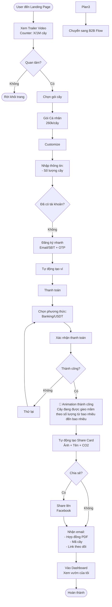
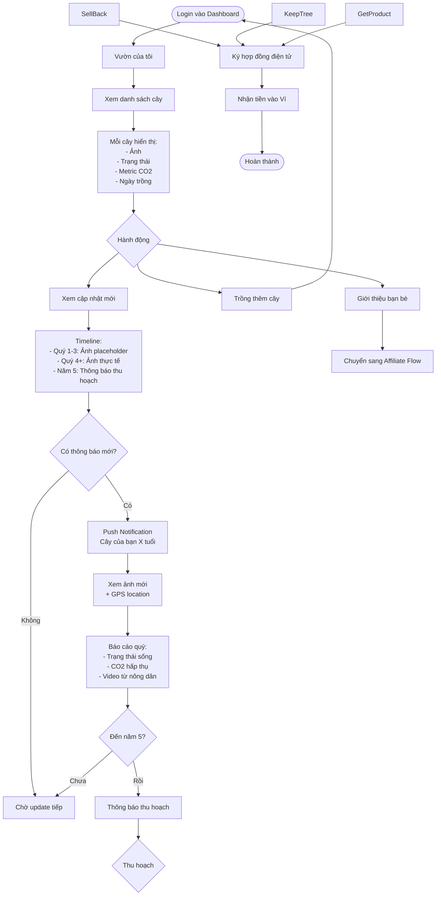
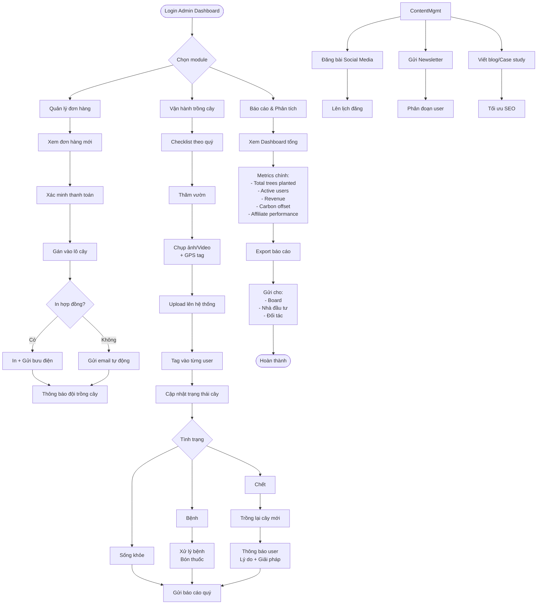

Đây là bộ ** User Flow Diagrams** dạng Mermaid cho dự án Đại Ngàn Xanh [code:file]. 

***

## 1️⃣ FIRST-TIME BUYER JOURNEY

***

## 2️⃣ TREE TRACKING JOURNEY

***

## 5️⃣ ADMIN/OPERATIONS FLOW

***

## 📌 Lưu ý khi implement

**Conversion Funnel cần track:**
- Landing → Sign up: Tỷ lệ này nên >15%
- Sign up → Purchase: Nên >60% (vì đã quan tâm)
- Purchase → Share: Nên >30% (viral loop)

**Critical Touch Points:**
- **Instant gratification** sau thanh toán (Share Card + Animation)
- **Quarterly updates** với ảnh thực tế (giữ engagement)
- **Year 5 notification** với 3 options rõ ràng (tránh thất vọng)

**Tech Priority (MVP):**
1. Buyer Flow → Track Flow → Payment Flow (Core)
2. Affiliate Dashboard → Withdrawal (Growth engine)
3. Admin Operations (Cho team vận hành)
4. Corporate Flow (Phase 2, sau khi có case study từ B2C)

Bạn muốn tôi detail thêm phần nào hoặc vẽ thêm swimlane diagram (phân biệt Frontend/Backend/External Service) không? [code:file]

Sources
